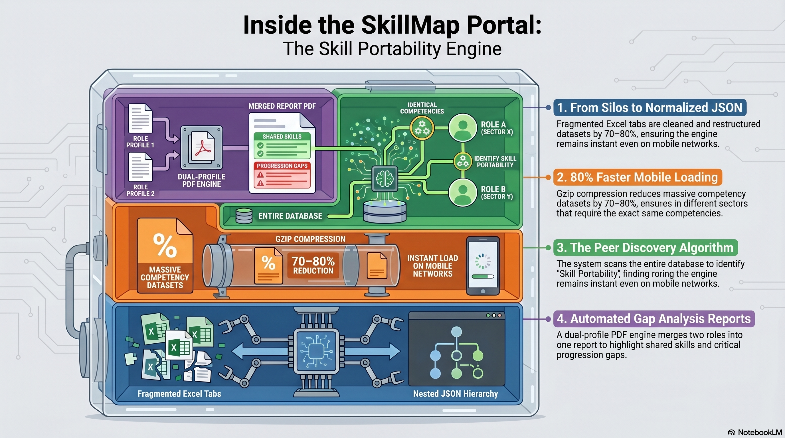

# 🗺️ SkillMap Portal

An interactive, data-driven web application designed to visualize and compare professional competency frameworks. The **SkillMap Portal** allows users to traverse complex skill ecosystems, identify "Skill Portability" across industry sectors, and generate professional, customized career reports.

🌐 Live Demo https://huggingface.co/spaces/Miqqie/

-----

## 📋 Table of Contents

1.  [The Motivation](#the-motivation)
2.  [Objective](#objective)
3.  [Data Architecture & Pipeline](#data-architecture--pipeline)
4.  [Technical Stack](#technical-stack)
5.  [Special Features](#special-features)
6.  [Customizable User Experience](#customizable-user-experience)
7.  [Automated PDF Report Engine](#automated-pdf-report-engine)
8.  [VS Code Setup & Extensions](#vs-code-setup--extensions)
9.  [How to Use](#how-to-use)

----

## 💡 The Motivation 

The genesis of this project was a real-world data accessibility challenge. The original competency frameworks were stored in an **Excel workbook spread across several different worksheets**.

While the data was comprehensive, the format created a "Silo Effect":

  * **Disconnected Data**: Information was fragmented. A user interested in a specific role would have to manually toggle between several tabs to find the corresponding skills, descriptions, and work functions.
  * **No Unified View**: There was no single interface that could aggregate this data into a cohesive "Career Profile."
  * **Barriers to Analysis**: Identifying skill overlaps between **different job roles** required significant manual effort and cross-tab referencing, making the data difficult for non-technical users to leverage for career planning.

[⬆ Back to Table of Contents](#-table-of-contents)

-----

## 🎯 Objective 
 
The SkillMap Portal bridges the gap between static competency documentation and dynamic career planning. By providing a multi-dimensional view of skills and job roles, the application helps:

  * **Employees** identify their next career move by comparing skill overlaps.
  * **HR Professionals** analyze the density of specific competencies across an entire sector.
  * **Job Seekers** discover "hidden" portability between different job roles and industry sectors.

[⬆ Back to Table of Contents](#-table-of-contents)

-----

## 🗂️ Data Architecture & Pipeline 

To move from fragmented Excel sheets to a high-performance web portal, the data undergoes a specific transformation pipeline: **Excel/CSV → Hierarchical JSON → Gzip Compression**.

### The Conversion Process:

1.  **Normalization**: Raw CSV exports from various worksheets are cleaned and normalized to ensure consistent Skill IDs and Role names.
2.  **Hierarchical Mapping**: Unlike flat CSV rows, the data is structured into a nested JSON format with four distinct collections: `job_roles` (the skills matrix), `skills_map` (role-to-sector mapping), `descriptions` (role descriptions), and `cwf` (Critical Work Functions). This allows a single "Job Role" object to contain its associated skills, work functions, and proficiency levels as sub-arrays.
3.  **Header Reordering**: On load, specific column pairs are swapped for logical display order (e.g., Classification before Items, Code before Category) without altering the underlying data.
4.  **Compression**: The resulting JSON is compressed into a `.gz` (Gzip) file before being hosted on the server.

### Why Convert & Compress?

  * **Relational Efficiency**: JSON allows for complex "Many-to-Many" relationships (e.g., one skill appearing in many roles) that are cumbersome to navigate in flat CSV worksheets.
  * **Payload Reduction**: Large competency datasets can exceed 5MB+ in plain text. Gzip compression reduces this footprint by **70–80%**, ensuring the app loads instantly even on mobile networks.
  * **Client-Side Speed**: Browsers can parse JSON into JavaScript objects natively. By delivering pre-structured JSON, the application avoids the performance "tax" of parsing raw CSV strings every time a user filters a role.

[⬆ Back to Table of Contents](#-table-of-contents)

-----

## 🛠️ Technical Stack 

The SkillMap Portal utilizes a "Modern Vanilla" architecture.

### 1\. The Engine: Vanilla JavaScript (ES6+)

JavaScript provides the **behavior** of the portal. "Vanilla" refers to using the language in its purest form without external frameworks like React or Angular.

  * **Why Vanilla?** It eliminates "framework overhead," ensuring the app remains lightweight and loads nearly instantly.
  * **Asynchronous Logic:** Uses `async/await` patterns to decompress and process data in the background.

### 2\. Performance: Pako (zlib)

To handle the large-scale data, the portal uses **Pako**. It fetches the compressed `.gz` data and decompresses it instantly in the browser's memory.

### 3\. Document Logic: jsPDF & jspdf-autotable

Used for professional documentation, manually calculating coordinates to place headers, footers, and intersection highlights.

### 4\. UI Architecture: Custom CSS & Responsive Design

  * **Custom CSS Variables:** Allows **Larger Text Mode** and **Compact View** to work by swapping single values that update the entire UI instantly.
  * **Flexbox & CSS Grid:** Ensures alignment regardless of screen size.
  * **Mobile-First Sidebar:** On screens below 900px, the filter panel becomes a fixed off-canvas drawer toggled by a top bar button, with a dimmed overlay for focus management.

[⬆ Back to Table of Contents](#-table-of-contents)

-----

## ✨ Special Features  

### 1\. Advanced Multi-Pivot Grid

The core engine allows users to pivot data dynamically. You can set Rows, Columns, and Content values to create a custom matrix view of any role's requirements, allowing for a 360-degree view of competency levels.

### 2\. Sector & Track Analytics

The interface features interactive **Sector and Track pills**. Clicking these triggers an automated analysis across all roles within that category to identify and display the **most in-demand skills**, each individually hyperlinked for deeper exploration.

### 3\. "Skill Portability" Discovery

The **Peer Discovery** algorithm scans the entire database to find other roles—even those in completely different sectors—that require that exact skill at the same level. Results are grouped by sector with clear subheadings for quick orientation.

### 4\. Collapsible Columns

On both desktop and mobile, any data column can be collapsed to a narrow indicator strip by clicking its header chevron (▼/▶). This lets users focus on the columns most relevant to them without losing context of the full matrix structure. Column collapse states persist across re-renders within the same session.

### 5\. Integrated Training Discovery

Every skill displayed in the grid table is **dynamically hyperlinked**. Clicking a skill name triggers a direct search on the `myskillsfuture.gov.sg` portal, connecting theoretical competencies to real-world training courses.

[⬆ Back to Table of Contents](#-table-of-contents)

-----

## 🎛️ Customizable User Experience 

The interface acts as a flexible workspace, allowing users to shape exactly what data they see:

  * **Information Filtering**: Toggle specific data layers using the sidebar dropdowns for Rows, Columns, and Content.
  * **Compact Mode**: Switches the table to a condensed layout, enabling more columns to be viewed simultaneously. Automatically locks on when a second column dimension (Cols 2) is active, with a visual lock indicator explaining why.
  * **Larger Text Mode**: Re-scales the entire UI for accessibility or group presentations, including modal dialogs and tooltips.
  * **Collapsible Description**: The role description in the breadcrumb header can be expanded or collapsed by clicking, useful in Large Text Mode where it may otherwise dominate the layout.

[⬆ Back to Table of Contents](#-table-of-contents)

-----

## 📄 Automated PDF Report Engine 

The application features a sophisticated PDF generation engine powered by **jsPDF** and **autoTable**, designed to translate complex, interactive UI states into clean, professional, and print-ready reports. It employs two distinct rendering logic paths depending on the user's intent:

### 1. The Dynamic Matrix Export (Pivot Grid)

This mode captures the exact analytical state of the interactive grid and reproduces it faithfully in PDF form.

  * **Matrix Preservation:** Retains the full row/column structure configured in the UI, including dynamically selected dimensions (e.g., Roles, Skills, Proficiency Levels).
  * **Dynamic Column Handling:** Automatically calculates column widths and scaling to accommodate variable data density without breaking layout.
  * **Pagination Intelligence:** Large matrices are split across multiple pages with structural continuity maintained.
  * **Contextual Headers:** Repeats column headers on each page and applies "(CONTINUED)" indicators to preserve readability across page breaks.
  * **Unicode Sanitization:** Header cells are stripped of non-ASCII characters (chevrons, special symbols) before rendering to ensure clean output in Helvetica, preserving em-dashes and en-dashes as ASCII equivalents.
  * **Data Fidelity:** Ensures that no transformations or aggregations alter the original analytical view—what users see is exactly what gets exported.

### 2. The Comprehensive Job Comparison Report

This mode generates a structured, insight-driven document designed for decision-making and career planning.

  * **Dual-Profile Synthesis:** Merges two selected job roles into a unified report, aligning their respective competencies into a single comparative framework.
  * **Shared Competency Detection:** Automatically identifies overlapping skills and groups them to highlight common ground between roles.
  * **Gap Analysis:** Separates role-specific skills to clearly expose competency gaps and progression requirements.
  * **Intersection Visualization:** Emphasizes transferable skills, enabling users to quickly assess how their current experience maps to a target role.
  * **Narrative Structuring:** Organizes content into logically segmented sections (e.g., Shared Skills, Role-Specific Skills) for executive-level readability.

### Aesthetic & Functional Highlights

  * **Typography & Branding:** Maintains a clean, modern visual identity suitable for formal sharing (e.g., internal HR reviews, career consultations).
  * **Smart Page-Break Logic:** Prevents row splitting and ensures multi-line descriptions remain intact, preserving semantic meaning and readability.
  * **Alternating Row Styling & Accent Bars:** Even/odd row backgrounds and a color-coded left accent bar on the first column are reproduced in the PDF, maintaining visual consistency with the on-screen grid.

[⬆ Back to Table of Contents](#-table-of-contents)

-----

## 💻 VS Code Setup & Extensions 

To run the SkillMap Portal locally, you must use a local development server to bypass **CORS** security restrictions when fetching the data files.

### Required Extension: Live Server

To enable the **"Go Live"** functionality, install the following in VS Code:

  * **Live Server (by Ritwick Dey):**
      * **How to Install:** Search for "Live Server" in the Extensions tab (`Ctrl+Shift+X`) and click **Install**.
      * **How to Use:** Right-click `index.html` and select **"Open with Live Server"**, or click the **"Go Live"** button in the bottom status bar.

[⬆ Back to Table of Contents](#-table-of-contents)

-----

## 🚀 How to Use 

1.  **Filter**: Select a **Sector** and **Job Role** from the sidebar.
2.  **Analyze Demand**: Click on **Sector or Track pills** to identify the most in-demand skills in that area.
3.  **Explore**: Click on any **hyperlinked skill** to find relevant courses on MySkillsFuture.
4.  **Compare**: Click the Role pill to open the Comparison Modal and see skill transferability.
5.  **Collapse Columns**: Click any column header to collapse it to a narrow strip, keeping the matrix focused on what matters.
6.  **Export**: Use the **Export PDF** button to save your view as a professional, shareable report.

[⬆ Back to Table of Contents](#-table-of-contents)
