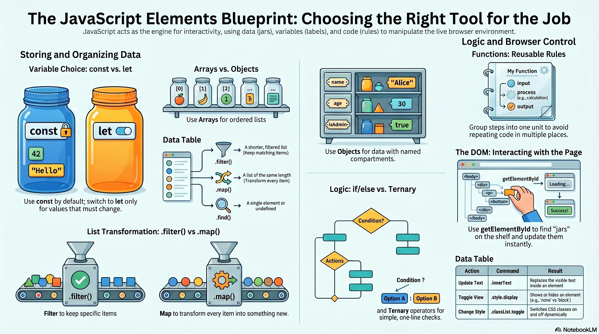
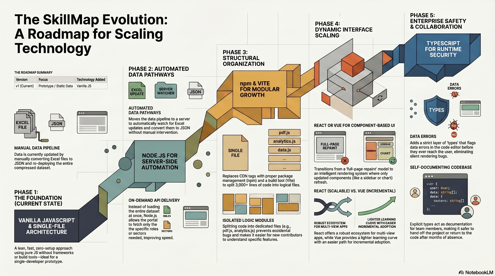

# 🚀 The Comprehensive Beginner's Guide to JavaScript
### Deep-Dive: Learning Through the SkillMap Portal

---

JavaScript is the engine that makes web pages interactive. While HTML provides the **structure** and CSS provides the **style**, JavaScript provides the **behavior** — everything that happens when you click a button, filter a dropdown, or export a PDF.

In this guide, JavaScript is explained using a consistent mental model:

> **Data** = Items inside jars  
> **Variables** = Labels attached to jars  
> **Code** = Rules that move, modify, or read jars

Every example in this guide comes directly from `index.html` in the SkillMap Portal — so you can see real, working code alongside the explanation.

---

## 📋 Table of Contents

1. [The Building Blocks of JavaScript](#1--the-building-blocks-of-javascript)
2. [The Naming Confusion: Java vs JavaScript](#2--the-naming-confusion-java-vs-javascript)
3. [JavaScript vs Python: Syntax & Element Management](#3--javascript-vs-python-syntax--element-management)
4. [Variables: Jars and Labels](#4--variables-jars-and-labels)
5. [Functions: Reusable Rules](#5--functions-reusable-rules)
6. [DOM Interaction: Reading and Updating the Page](#6--dom-interaction-reading-and-updating-the-page)
7. [Arrays & Array Methods: Working with Lists](#7--arrays--array-methods-working-with-lists)
8. [Objects: Named Jars with Multiple Compartments](#8-objects-named-jars-with-multiple-compartments)
9. [Loops: Repeating Rules Across Jars](#9--loops-repeating-rules-across-jars)
10. [Conditionals: Decision Making](#10--conditionals-decision-making)
11. [Asynchronous JavaScript: Fetching & Loading Data](#11--asynchronous-javascript-fetching--loading-data)
12. [Template Literals: Building HTML Strings](#12--template-literals-building-html-strings)
13. [Events: Listening for User Actions](#13-events-listening-for-user-actions)
14. [Data Transformation & Regular Expressions](#14--data-transformation--regular-expressions)
15. [Quick Reference: Key Commands](#15--quick-reference-key-commands)
16. [Extending the SkillMap Portal: Future Possibilities](#16--extending-the-skillmap-portal-future-possibilities)

---

## 1. 🧱 The Building Blocks of JavaScript

Before diving into any specific topic, it helps to understand what JavaScript is actually made of. Every JavaScript program — no matter how big or small — is built from just a handful of core ingredients. Once you recognise these, reading code starts to feel a lot less like a foreign language.

Think of it like cooking. You don't need to know every recipe in the world. You just need to understand what an ingredient *is* and what it *does* — then you can follow any recipe.

Here are the core building blocks:



---

### 📦 Values — The Raw Ingredients

A **value** is simply a piece of information. It could be a number, a word, a true/false switch, or nothing at all.

```javascript
42              // a number
"Hello"         // a piece of text (called a "string")
true            // a yes/no switch (called a "boolean")
null            // deliberately empty — "there is nothing here"
undefined       // hasn't been given a value yet
```

You'll see these everywhere. For example, when the portal checks whether a dropdown has been filled in:

```javascript
// If sVal is empty (""), null, or undefined — all of these are "falsy"
if (!sVal || !rVal) return;
```

Values are the foundation everything else is built on. Every variable holds a value, every array is a list of values, every function works with values.

---

### 🏷️ Variables — Labels on Jars

A **variable** is a named container that holds a value. You create one with `const` or `let`, give it a name, and assign a value to it. From then on, you can use that name anywhere instead of writing the raw value out every time.

```javascript
const roleName = "Software Engineer";   // a label stuck to a text value
let pageNumber = 1;                      // a label that will move as pages increase
```

Variables make your code readable and reusable. Instead of writing `"Software Engineer"` twenty times, you write `roleName` — and if it ever changes, you only update it in one place.

→ *Deep dive: [Variables: Jars and Labels](#4-variables-jars-and-labels)*

---

### 📋 Data Structures — Jars That Hold Many Things

Sometimes one value isn't enough. JavaScript gives you two ways to group values together:

**Arrays** — an ordered list (like a numbered shelf of jars):
```javascript
const sectors = ["Healthcare", "Finance", "Technology"];
sectors[0]; // "Healthcare" — counting starts at zero
```

**Objects** — a collection of named values (like a jar with labelled compartments):
```javascript
const skill = {
    name: "Data Analysis",
    level: 3,
    required: true
};
skill.name; // "Data Analysis"
```

In the SkillMap Portal, the entire dataset is one giant object with arrays inside it — sectors, roles, skills, and work functions all stored as named lists.

→ *Deep dive: [Arrays & Array Methods](#7-arrays--array-methods-working-with-lists) · [Objects](#8-objects-named-jars-with-multiple-compartments)*

---

### ⚙️ Functions — Reusable Instructions

A **function** is a named set of steps that you can run whenever you need them. You write the instructions once, give them a name, and then call that name to run them.

```javascript
function showWelcome() {
    document.getElementById('welcome-msg').style.display = 'flex';
}

showWelcome(); // runs those steps right now
```

Functions are how JavaScript avoids repeating itself. The SkillMap Portal has functions for rendering the table, opening modals, toggling panels, exporting PDFs — each one is a self-contained set of instructions with a clear name.

→ *Deep dive: [Functions: Reusable Rules](#5-functions-reusable-rules)*

---

### 🔀 Control Flow — Decision Making and Repetition

Code doesn't always run top to bottom. **Control flow** lets you make decisions and repeat steps.

**Conditionals** let the code choose a path:
```javascript
if (isLargeText) {
    fontSize = "18px";  // take this path
} else {
    fontSize = "12px";  // or take this one
}
```

**Loops** let the code repeat a step multiple times:
```javascript
// Run this once for every page in the PDF
for (let i = 1; i <= totalPages; i++) {
    doc.setPage(i);
    doc.text(`Page ${i}`, 100, 290);
}
```

→ *Deep dive: [Conditionals: Decision Making](#10-conditionals-decision-making) · [Loops: Repeating Rules Across Jars](#9-loops-repeating-rules-across-jars)*

---

### 🌐 The DOM — The Live Page You Can Touch

The **DOM (Document Object Model)** is the browser's internal map of your webpage. Every button, dropdown, heading, and table is a node in this map — and JavaScript can read or change any of it at any time.

```javascript
// Find the welcome message on the page and hide it
document.getElementById('welcome-msg').style.display = 'none';

// Write new text into the role pill
document.getElementById('final-role').innerText = "Software Engineer";
```

The DOM is what makes JavaScript visual. Without it, JavaScript would just crunch numbers silently in the background. With it, every change you make shows up instantly on screen.

→ *Deep dive: [DOM Interaction: Reading and Updating the Page](#6-dom-interaction-reading-and-updating-the-page)*

---

### 🎧 Events — Listening for the User

An **event** is something the user does — clicking, typing, selecting from a dropdown, resizing the window. JavaScript can listen for these and respond with a function.

```javascript
// When the sector dropdown changes, run updateRoles()
<select onchange="updateRoles()">

// When the column header is clicked, collapse that column
th.onclick = () => toggleColumn(idx);
```

Events are the bridge between the user and the code. Without events, nothing would ever happen — the page would just sit there.

→ *Deep dive: [Events: Listening for User Actions](#13-events-listening-for-user-actions)*

---

### 🔄 How They All Fit Together

Here's the big picture: **values** are the raw data. **Variables** give them names. **Data structures** group them. **Functions** do things with them. **Control flow** decides when and how many times. **The DOM** puts the results on screen. **Events** make it respond to the user.

In the SkillMap Portal, every single interaction follows this same chain:

> **User clicks a dropdown** *(event)* → **`render()` fires** *(function)* → **reads the selected values** *(variables)* → **filters through thousands of rows** *(data structures + control flow)* → **updates the table on screen** *(DOM)*

Once you see that chain, the rest of the guide is just filling in the details of each step.

---

### 📋 Summary Table

| Building Block | What It Is | Real-World Analogy | Go Deeper |
|---|---|---|---|
| **Value** | A raw piece of data — a number, word, yes/no, or nothing | An ingredient in a recipe | [Variables](#4-variables-jars-and-labels) |
| **Variable** | A named label attached to a value | A sticky note on a jar | [Variables](#4-variables-jars-and-labels) |
| **Array** | An ordered list of values | A numbered shelf of jars | [Arrays & Array Methods](#7-arrays--array-methods-working-with-lists) |
| **Object** | A collection of named values grouped together | A jar with labelled compartments | [Objects](#8-objects-named-jars-with-multiple-compartments) |
| **Function** | A named set of reusable instructions | A named recipe you can follow any time | [Functions](#5-functions-reusable-rules) |
| **Conditional** | A decision — do this *or* do that depending on the situation | A fork in the road | [Conditionals](#10-conditionals-decision-making) |
| **Loop** | A repeated instruction — do this *for every item* or *until done* | An assembly line | [Loops](#9-loops-repeating-rules-across-jars) |
| **DOM** | The live map of everything visible on the page | The stage that the audience sees | [DOM Interaction](#6-dom-interaction-reading-and-updating-the-page) |
| **Event** | Something the user does that triggers a response | Pressing a doorbell — the chime is the function | [Events](#13-events-listening-for-user-actions) |

[⬆ Back to Table of Contents](#-table-of-contents)

---

## 2. 🛑 The "Naming Confusion": Java vs JavaScript

<details>
<summary>Click to expand</summary>

One of the most frequent points of confusion for beginners is the nomenclature. Despite the similar branding, **Java and JavaScript are entirely different languages** with distinct architectures and purposes.

### The Origins of the Name

In 1995, Java was the most prominent programming language globally. JavaScript was originally developed as "LiveScript," but was renamed to "JavaScript" as a marketing strategy to capitalize on Java's enormous mindshare at the time.

> A common industry analogy: **"Java is to JavaScript as Car is to Carpet."** They share a prefix but serve completely unrelated functions.

### Key Technical Differences

| Feature | JavaScript *(Used in this Portal)* | Java *(The "Other" Language)* |
|---|---|---|
| **Primary Goal** | Interactivity — controls what happens on screen | Structure — handles backend systems and heavy processing |
| **Execution** | Runs directly inside web browsers | Runs inside a Virtual Machine (JVM) |
| **Flexibility** | Dynamic — easier to change and adapt quickly | Strict — requires precise type definitions for stability |
| **Where You Write It** | Inside `<script>` tags in an HTML file | In separate `.java` files, compiled before running |

In the SkillMap Portal, JavaScript handles **everything the user can interact with**: loading data, building the table, opening modals, filtering dropdowns, and generating PDFs — all without a page refresh.

[⬆ Back to Table of Contents](#-table-of-contents)

</details>

---

## 3. 🐍 JavaScript vs Python: Syntax & Element Management

<details>
<summary>Click to expand</summary>

### 1. The Grammar (Syntax) Gap

Different languages organize instructions differently.

- **JavaScript** uses curly braces `{ }` to group blocks of code, and semicolons `;` to end statements.
- **Python** uses indentation (whitespace) to define blocks, and no semicolons.

```javascript
// JavaScript: curly braces + semicolons
function greet(name) {
    return "Hello, " + name + "!";
}
```

```python
# Python: indentation, no braces
def greet(name):
    return "Hello, " + name + "!"
```

Both do the same thing — the syntax is just different grammar for the same idea.

### 2. Element Management: Internal vs External Access

This is one of the most practically important differences for web development.

**JavaScript** operates *inside* the browser. The page is already loaded around it, so it has **direct, native access** to every element on screen via the **DOM** (Document Object Model).

**Python**, when used for browser automation (e.g., with Selenium), operates *externally* — it has to act as a remote controller reaching into the browser from the outside.

#### Finding Elements (The "Hook")

Think of the webpage as a collection of labeled jars already arranged on a shelf. Finding an element is reaching for a specific jar.

| Feature | JavaScript | Python (Selenium) |
|---|---|---|
| **Command** | `document.getElementById('sel-sector')` | `driver.find_element(By.ID, 'sel-sector')` |
| **Access type** | Direct (already inside the system) | Indirect (must reach in from outside) |
| **Speed** | Immediate | Slight overhead per call |

In the SkillMap Portal, JavaScript grabs elements constantly:

```javascript
// From render() in index.html — grabbing the sector dropdown directly
const sVal = document.getElementById('sel-sector').value;
const rVal = document.getElementById('sel-role').value;

// If either is empty, stop immediately — no point building a table
if (!sVal || !rVal) return;
```

No external tool required — the code is *already on the page*, so access is instant.

[⬆ Back to Table of Contents](#-table-of-contents)

</details>

---

## 4. 📦 Variables: Jars and Labels

<details>
<summary>Click to expand</summary>

### What Is a Variable?

A **variable** is a named storage slot in your program's memory. Think of it as a jar with a label stuck to it — the label is the variable's name, and whatever is inside the jar is its value.

You create a variable using either `const` or `let`, followed by a name you choose, then `=`, then the value to store:

```javascript
const myName = "Alex";   // the jar labelled "myName" holds the text "Alex"
let score = 0;           // the jar labelled "score" holds the number 0
```

After that, whenever you write `myName` anywhere in your code, JavaScript knows to look inside that jar and use whatever's there. This means you don't have to keep rewriting `"Alex"` — and if the name ever changes, you only update it in one place.

The key question is: which keyword do you use — `const` or `let`?

---

### 🔒 `const` — Fixed Label

Use `const` when the label should **never be moved to a different jar**. Once you stick the label on, it stays.

```javascript
// A primitive: the label '5' is stuck to the number jar
const count = 5;

// An object: the label is stuck to the PDF engine jar,
// but the engine itself can still have pages added to it
const doc = new jsPDF('l', 'mm', 'a4');
```

**From the SkillMap Portal:**

```javascript
// From downloadPDF() — these references never need to change,
// so const is the right choice
const { jsPDF } = window.jspdf;
const doc = new jsPDF('l', 'mm', 'a4');
const pageWidth  = doc.internal.pageSize.getWidth();
const pageHeight = doc.internal.pageSize.getHeight();
const primaryEmerald = [16, 185, 129]; // RGB color — fixed config value
```

> **What this shows:** All five variables are set up once and never reassigned. `doc` is the PDF document being built. `pageWidth` and `pageHeight` are the page dimensions (needed to center text and position content). `primaryEmerald` is the green colour used for headings — it's a fixed design value, so `const` is appropriate.

---

### 🔄 `let` — Movable Label

Use `let` when the label **might need to be reassigned** to a different jar over time — a counter, a running total, a cursor position that moves.

```javascript
// From downloadPDF() — y tracks the current vertical pen position on the PDF
// and moves down as content is drawn
let y = 32;

// After drawing the description block:
y += descHeight + 10; // label moves to the new position jar

// After drawing another section:
y += 8;               // moves again
```

> **What this shows:** `y` starts at 32 (32mm from the top of the page). Each time a section is drawn, `y` increases by the height of that section plus a small gap. This is how the PDF knows where to place each new line of content — without `let`, you couldn't update `y` as you go.

Another example — a running text string that grows:

```javascript
// From cleanText() — filtered starts empty and characters are appended one by one
let filtered = "";
for (let i = 0; i < str.length; i++) {
    let code = str.charCodeAt(i);
    if (code === 32 || (code >= 33 && code <= 126)) {
        filtered += str[i]; // label reassigned to a longer string jar each time
    }
}
```

> **What this shows:** `filtered` begins as an empty string `""`. The loop goes through each character in `str` one by one, and if the character is a normal printable ASCII character (things like letters, numbers, punctuation), it gets added to `filtered`. By the end, `filtered` holds a clean version of the original string with any unusual characters removed.

---

### 🧭 When to Use `const` vs `let`

Think of it this way: **if you're going to stick a label on a jar and never move it, use `const`. If the label might need to move to a different jar later, use `let`.**

> **Rule of thumb:** Start with `const` for everything. Only switch to `let` when JavaScript complains — or when you already know the value will change (like a score that goes up, or a position that moves).

Here are some everyday examples to make it click:

**Use `const` when the thing stays the same:**
- A button on the page — it's always *that* button, you're just clicking it
- A colour like `[16, 185, 129]` — it doesn't change mid-way through
- The data you loaded from a file — the contents can update, but the container stays the same

**Use `let` when the thing needs to change:**
- A page counter that goes `1, 2, 3...` as you loop through PDF pages
- A running Y position on the PDF that moves down as you draw each section
- A piece of HTML text you're building up piece by piece

In short: `const` is a label **glued** to the jar. `let` is a label on a **sticky note** — easy to peel off and move.

[⬆ Back to Table of Contents](#-table-of-contents)

</details>

---

## 5. 🔧 Functions: Reusable Rules

<details>
<summary>Click to expand</summary>

### What Is a Function?

A **function** is a named block of instructions that you can run whenever you need them. Instead of writing the same ten lines of code in five different places, you write them once inside a function, give the function a name, and then call that name to run all those steps instantly.

Think of it like a recipe card. You write the instructions once: "preheat oven, mix ingredients, bake for 30 minutes." Then any time you want cake, you just say "make cake" — you don't rewrite the whole recipe.

```javascript
// Basic shape of a function
function doSomething(input) {
    // steps here
    return result;
}
```

- The word `function` declares you're creating one.
- The name (`doSomething`) is what you'll call to run it.
- `input` in the parentheses is an **argument** — a value you pass *in* for the function to work with.
- `return result` sends a value *back out* to whoever called the function.

---

### From the Portal: `toggleCWF()`

```javascript
// Toggles the Critical Work Functions panel open/closed
function toggleCWF() {
    const c = document.getElementById('cwf-container');
    const i = document.getElementById('cwf-icon');
    c.classList.toggle('expanded');
    // Ternary: if expanded show ▲, otherwise show ▼
    i.innerText = c.classList.contains('expanded') ? '▲' : '▼';
}
```

> **What this shows:** When the user clicks the "Critical Work Functions" header, `toggleCWF()` runs. It finds the panel container (`c`) and the arrow icon (`i`). `.classList.toggle('expanded')` adds the CSS class `expanded` if it isn't there, or removes it if it is — this is what animates the panel sliding open or closed. The last line updates the arrow to point up (▲) when open or down (▼) when closed. Without the function, you'd have to copy-paste these four lines everywhere the toggle appears.

---

### From the Portal: `toggleColumn(colIdx)`

```javascript
// Collapses or expands a specific table column by its index
function toggleColumn(colIdx) {
    const isNowCollapsed = !window._collapsedCols[colIdx]; // flip the boolean
    window._collapsedCols[colIdx] = isNowCollapsed;         // remember the new state
    const table = document.getElementById('grid');
    applyCollapsed(colIdx, isNowCollapsed, table);           // delegate the visual work
}

function applyCollapsed(colIdx, collapse, table) {
    if (!table) return;
    // Update the header cell
    const th = table.querySelectorAll('thead th')[colIdx];
    if (th) th.classList.toggle('col-collapsed', collapse);
    // Update every body cell in that column
    table.querySelectorAll('tbody tr').forEach(row => {
        const cell = row.querySelectorAll('td')[colIdx];
        if (cell) cell.classList.toggle('col-collapsed-cell', collapse);
    });
}
```

> **What this shows:** `toggleColumn` takes a column number (`colIdx`) as its input — this tells it *which* column to act on. It first flips the column's stored state from collapsed to expanded (or vice versa) using `!` (the "not" operator). Then it hands off the visual work to a second function, `applyCollapsed`. That second function goes through every header cell and every body cell in that column and toggles the `col-collapsed` CSS class, which is what actually hides or shows the column visually. Notice how `toggleColumn` decides *what* to do and `applyCollapsed` handles *how* — this **separation of concerns** makes both functions easier to read and maintain.

---

### Arrow Functions: The Shorthand Form

Arrow functions (`=>`) are a shorter syntax for writing functions, commonly used for small, one-purpose operations.

```javascript
// Traditional function
function double(n) { return n * 2; }

// Equivalent arrow function
const double = (n) => n * 2;
```

> **What this shows:** Both versions do the same thing — take a number `n` and return it doubled. The arrow function is just shorter to write. The `=>` ("fat arrow") replaces `function` and `return` when there's a single expression. You'll see arrow functions used heavily inside array methods because they're quick to write inline.

From the Portal, arrow functions appear constantly inside array methods:

```javascript
// Each d is a row of job data — find the one matching the selected role
const roleData = jobData.find(d => d[rKey] === rVal && d[sKey] === sVal);

// Get a friendly label for a column header
const getFriendlyLabel = (label) => {
    const l = label ? label.trim() : "";
    if (l.toUpperCase().startsWith("TSC")) return "Competencies";
    if (l.toUpperCase().startsWith("PROFICIENCY")) return "Proficiency";
    return "K&A";
};
```

> **What this shows:** The first example uses a one-liner arrow function to search `jobData` for the row whose role and sector columns both match the currently selected values. The second example is a slightly longer arrow function that translates raw column header names (like `"TSC_CCS Code"`) into cleaner display labels (like `"Competencies"`) — this is how the portal shows friendly column names in the table instead of the raw internal names from the data file.

[⬆ Back to Table of Contents](#-table-of-contents)

</details>

---

## 6. 🌐 DOM Interaction: Reading and Updating the Page

<details>
<summary>Click to expand</summary>

### What Is the DOM?

When a browser loads an HTML file, it doesn't just display it — it builds an internal, live **map** of every element on the page. This map is called the **DOM (Document Object Model)**. Every heading, button, dropdown, table, and paragraph becomes a "node" in this map.

JavaScript can reach into this map at any time to **read** what's currently on the page or **change** it. When you change something in the DOM, the browser instantly updates what the user sees — no page reload needed.

Think of the DOM like a stage set. The HTML file is the blueprint. The DOM is the actual stage with all the props in place. JavaScript is the stagehand who can move, swap, or hide props while the show is running.

---

### Step 1 — Locating a Jar

```javascript
document.getElementById('welcome-msg');
```

> **What this does:** `document` refers to the whole page. `.getElementById('welcome-msg')` searches the DOM for the single element whose `id` attribute is `welcome-msg`. It returns that element so you can do something with it. It does **not** create a new one — it finds an existing one.

---

### Step 2 — Attaching a Label

```javascript
const welcome = document.getElementById('welcome-msg');
```

> **What this does:** Stores the reference to that element in a variable called `welcome`. Now instead of calling `document.getElementById('welcome-msg')` every single time, you just write `welcome`. This is faster, cleaner, and means if the ID ever changes, you only update one line.

---

### Step 3 — Modifying the Jar

```javascript
welcome.style.display = 'none'; // hide the welcome message
```

> **What this does:** Sets the CSS `display` property of the element to `'none'`, which makes it invisible. The element still exists in memory — it's just not shown. You can bring it back any time with `'flex'` or `'block'`.

---

### Types of DOM Interaction

| Type | Example | Purpose |
|---|---|---|
| **Read** | `inputBox.value` | Observe current contents |
| **Write** | `element.innerText = "New Title"` | Replace visible text |
| **Style** | `element.style.color = "red"` | Change appearance |
| **Control** | `element.style.display = "none"` | Include or exclude from render |
| **Class** | `element.classList.toggle('expanded')` | Switch CSS classes on/off |
| **HTML** | `element.innerHTML = "<b>Bold</b>"` | Replace with rich HTML content |

---

### From the Portal: The `render()` Function

`render()` is the heart of the portal. Every time a dropdown changes, `render()` fires and repaints the entire interface. Here is a slice of what it does using DOM interaction:

```javascript
function render() {
    const sVal = document.getElementById('sel-sector').value;  // READ the sector
    const rVal = document.getElementById('sel-role').value;    // READ the role
    if (!sVal || !rVal) return;                                 // Guard clause — exit early if incomplete

    // CONTROL: hide the welcome screen, show the data area
    document.getElementById('welcome-msg').style.display = 'none';
    document.getElementById('app-content').style.display = 'flex';

    // CONTROL: unlock the Export PDF button
    document.getElementById('btn-pdf').disabled = false;

    // WRITE: update the breadcrumb pill text
    document.getElementById('final-role').innerText = rVal;

    // WRITE + STYLE: update the description text
    const descRow = jobDescData.find(d => d[dR] === rVal);
    document.getElementById('final-desc').innerText = descRow ? descRow[dD] : "";
}
```

> **What this shows:** This function runs every time the user picks a sector or role. It first reads the current values of both dropdowns. If either is empty, it stops immediately (guard clause). Then it hides the welcome message and shows the main content area. It unlocks the PDF export button (which was disabled until a role was chosen). It updates the role name shown in the breadcrumb pill at the top. Finally, it looks up the job description for that role and displays it — or clears the field if no description is found.

> **Key Idea:** The DOM is a **live system**. Updates appear instantly without a page refresh because the browser immediately recalculates the layout after each change.

---

### From the Portal: Dynamically Building the CWF Panel

Rather than hardcoding HTML, JavaScript creates DOM elements programmatically and appends them to the page:

```javascript
// For each Critical Work Function group, build and attach a DOM node
for (const [fn, ts] of Object.entries(groups)) {
    const g = document.createElement('div');   // create a new <div> jar
    g.className = "cwf-group";                 // assign a CSS class
    g.innerHTML = `<div class="cwf-header">${fn}</div><ul class="task-list"></ul>`;

    // For each task in this function, create a list item and append it
    ts.forEach(t => {
        const li = document.createElement('li');
        li.className = "task-item";
        li.innerText = t;
        g.querySelector('ul').appendChild(li); // attach <li> to the <ul> inside g
    });

    cont.appendChild(g); // attach the whole group to the page container
}
```

> **What this shows:** Instead of writing HTML directly into the file, this code builds the Critical Work Functions panel entirely in JavaScript. For each function group (like "Manage Data" or "Analyse Requirements"), it creates a new `<div>`, gives it a heading, then loops through each task under that function and creates a `<li>` list item for it. Each item is attached to the list, and the whole group is then attached to the panel container on the page. This pattern — `createElement` → set content → `appendChild` — is a core DOM building block used any time content needs to be generated dynamically from data.

[⬆ Back to Table of Contents](#-table-of-contents)

</details>

---

## 7. 📋 Arrays & Array Methods: Working with Lists

<details>
<summary>Click to expand</summary>

### What Is an Array?

An **array** is an ordered list of values stored under a single variable name. Think of it as a numbered shelf of jars — each jar holds one value, and you access a specific jar by its position number (called an **index**).

Indexes start at **0**, not 1. So the first item is at index `0`, the second at `1`, and so on.

```javascript
const fruits = ["apple", "banana", "cherry"];
fruits[0]; // "apple"
fruits[1]; // "banana"
fruits[2]; // "cherry"
```

Arrays become powerful when you use their built-in **methods** — tools that let you filter, transform, search, or iterate over the whole list in a single, readable line.

---

### The "Big Four" Array Methods

#### `.filter()` — Keep only matching jars

`.filter()` goes through every item in an array and keeps only the ones where your test returns `true`. It returns a **new array** — the original is untouched.

```javascript
// From render() — keep only the skill rows that belong to this role and sector
const filtered = skillData.filter(d =>
    d[ss] === sVal &&
    pairs.has(`${(d[st] || "").trim()}|${(d[sl] || "").trim()}`)
);
```

> **What this shows:** `skillData` is a large array of rows — one for every skill in the framework. This `.filter()` keeps only the rows that (a) belong to the selected sector, and (b) match the selected skill title and level combination. The result, `filtered`, is a smaller array containing only the relevant rows to display in the table. If the user picks a different sector or role, `render()` reruns and `filtered` is rebuilt from scratch.

---

#### `.map()` — Transform every jar into a new shape

`.map()` goes through every item in an array and replaces it with the return value of your function. It always returns a **new array of the same length**.

```javascript
// From showSectorAnalytics() — convert the skill map object into an array of
// {name, count} objects that are easier to sort and display
const allSkills = Object.entries(skillToRolesMap)
    .map(([name, roleSet]) => ({ name: name, count: roleSet.size }))
    .filter(s => s.count > 0)
    .sort((a, b) => b.count - a.count);
```

> **What this shows:** `skillToRolesMap` is an object where each key is a skill name and each value is a Set of roles that require it. `.map()` converts each entry into a simple `{name, count}` object — `name` is the skill name, `count` is how many roles need it. The chain then filters out any skills with zero roles, and sorts the rest from most common to least. The end result is an array of skills ranked by how many roles they appear in — ready to display in the analytics panel.

---

#### `.find()` — Get the first matching jar

`.find()` searches through an array and returns the **first element** that matches your test, or `undefined` if nothing matches.

```javascript
// From updateRoles() — find the header column whose name contains "sector"
const sKey = jobHeaders.find(h => h.toLowerCase().includes('sector'));

// From render() — find the description row matching the selected role
const descRow = jobDescData.find(d => d[dR] === rVal);
```

> **What this shows:** The first example searches the array of column header names to find the one containing the word "sector" — this is how the portal locates the right column regardless of its exact name or position. Instead of hardcoding `jobHeaders[2]`, it finds the right column by name, making the code resilient to column reordering. The second example finds the job description row whose role column matches the currently selected role, so the portal can display the correct description text.

---

#### `.forEach()` — Run a rule for every jar (no return value)

`.forEach()` runs a function once for every item in the array. Unlike `.map()` and `.filter()`, it doesn't return anything — it's for **side effects** like updating the DOM or building strings.

```javascript
// From updateRoles() — add each role as an <option> in the dropdown
roles.forEach(r => rSelect.add(new Option(r, r)));

// From showPeerRoles() — build the HTML for each sector's roles
sortedSectorNames.forEach(secName => {
    const roles = Array.from(diffSectorGroups[secName]).sort();
    diffSectorsHtml += `<div>...</div>`;
});
```

> **What this shows:** The first example loops through every role name in `roles` and adds it as an `<option>` element to the role dropdown — this is how the dropdown gets populated after a sector is chosen. The second example loops through each sector name and builds a chunk of HTML for it, appending each chunk to `diffSectorsHtml`. This is the "side effect" pattern — `.forEach()` is used when the goal is to *do something* with each item, not to produce a new array.

---

### Chaining Methods

Because these methods return arrays, you can **chain them** — the output of one becomes the input of the next:

```javascript
// From updateRoles() — one readable pipeline:
// 1. Filter job data to the selected sector
// 2. Extract the role name from each row (.map)
// 3. Remove duplicates ([...new Set(...)])
// 4. Remove empty strings (.filter(Boolean))
// 5. Sort alphabetically (.sort)
const roles = [...new Set(
    jobData
        .filter(d => d[sKey] === sVal)
        .map(d => d[rKey])
)].filter(Boolean).sort();
```

> **What this shows:** This single chain does five things in sequence. It starts with `jobData` (thousands of rows). `.filter()` keeps only rows matching the selected sector. `.map()` extracts just the role name from each remaining row. `new Set(...)` removes duplicates (some roles appear many times across different skills). `[...new Set(...)]` spreads it back into an array. `.filter(Boolean)` removes any empty strings (rows where the role field was blank). `.sort()` alphabetises the list. The result is a clean, sorted, deduplicated list of roles for that sector.

---

### Removing Duplicates with `Set`

A `Set` is a collection that **automatically rejects duplicates**. Wrapping an array in `new Set(...)` and spreading it back with `[...]` is the idiomatic JavaScript way to deduplicate:

```javascript
// Get all unique sector names from thousands of job rows
const sectors = [...new Set(jobData.map(d => d[sKey]))].filter(Boolean).sort();

// Get the unique content items in a table cell
const uniqueItems = [...new Set(filtered.map(d => d[v]).filter(val => val && val !== '-'))];
```

> **What this shows:** The first line maps over all job data rows to extract the sector column, then deduplicates with `Set`, removes blanks, and sorts. Even if "Infocomm Technology" appears 500 times in the raw data, it appears only once in `sectors`. The second line does the same for table cell values — if a skill appears multiple times in the filtered rows, it only gets listed once in that cell.

[⬆ Back to Table of Contents](#-table-of-contents)

</details>

---

## 8. Objects: Named Jars with Multiple Compartments

<details>
<summary>Click to expand</summary>

### What Is an Object?

An **object** groups related data together under named keys. Where an array uses numbered positions to store values, an object uses **names** (called **keys** or **properties**) — like a jar with labelled compartments inside.

```javascript
const skill = {
    name: "Data Analysis",
    level: 3,
    sector: "Infocomm Technology"
};

skill.name;      // "Data Analysis" — dot notation
skill["level"];  // 3 — bracket notation (useful when the key is stored in a variable)
```

Objects are the backbone of how data is structured in JavaScript. Nearly every piece of real-world data — a user account, a product listing, a row from a spreadsheet — is represented as an object.

---

### From the Portal: JSON Data Structure

The entire portal's data arrives as a single JSON object with four named sections:

```javascript
// After fetch and decompression:
const data = JSON.parse(decompressed);

// Each key is a named compartment in the data jar
skillData    = data.job_roles.records;    // the skills matrix rows
skillHeaders = data.job_roles.columns;    // the column names
jobData      = data.skills_map.records;   // role-to-sector mapping
cwfData      = data.cwf.records;          // Critical Work Functions
```

> **What this shows:** `data` is one large object. It has several top-level keys: `job_roles`, `skills_map`, `cwf`, and so on. Each of those is itself an object with sub-keys like `records` (the actual rows) and `columns` (the header names). By pulling out `data.job_roles.records`, the portal gets the array of skills matrix rows it needs. This nested object structure mirrors how a spreadsheet with multiple sheets works — the outer object is the workbook, each key inside is a sheet.

---

### Building Objects Dynamically

Objects can also be built on-the-fly as data is processed:

```javascript
// From showSectorAnalytics() — build a map of skill → set of roles that need it
const skillToRolesMap = {};

jobData.forEach(d => {
    if (d[js] === sectorName) {
        const baseSkillName = d[jt].replace(/\s*level\s*\d+/gi, "").trim();

        // Create the key if it doesn't exist yet, then add the role
        if (!skillToRolesMap[baseSkillName]) skillToRolesMap[baseSkillName] = new Set();
        skillToRolesMap[baseSkillName].add(d[jr]);
    }
});
```

> **What this shows:** `skillToRolesMap` starts as an empty object `{}`. As the loop goes through each row of job data, it extracts the base skill name (stripping off level numbers like "Level 3"). If this skill name hasn't been seen before, a new `Set` is created as its value. The role from that row is then added to the Set. After the loop, `skillToRolesMap["Data Analysis"]` would be a Set containing every role that requires Data Analysis — e.g. `{"Data Analyst", "Business Analyst", "Data Engineer"}`. This is a common pattern: build a lookup object by processing a flat array of rows.

---

### Destructuring Objects

Rather than writing `const name = obj.name; const count = obj.count;`, JavaScript lets you **destructure** in one line — pulling multiple values out of an object at once:

```javascript
// From the PDF engine — pull jsPDF out of the global window.jspdf object
const { jsPDF } = window.jspdf;

// Equivalent to:
// const jsPDF = window.jspdf.jsPDF;
```

> **What this shows:** The PDF library attaches itself to the global `window.jspdf` object when loaded. Destructuring `{ jsPDF }` from it is shorthand for "give me the `jsPDF` property from `window.jspdf` and store it in a variable called `jsPDF`." Without destructuring, you'd have to write the full path every time you used it. This pattern appears constantly in modern JavaScript whenever libraries or data objects need to be unpacked.

[⬆ Back to Table of Contents](#-table-of-contents)

</details>

---

## 9. 🔄 Loops: Repeating Rules Across Jars

<details>
<summary>Click to expand</summary>

### What Is a Loop?

A **loop** is a way to repeat a block of code multiple times — either a set number of times, or once for each item in a list. Without loops, you'd have to write the same instruction out manually for every item, which is impractical when you have hundreds or thousands of items.

Think of it like an assembly line: the same action (stamp, fill, label) is applied to every box as it comes down the line, without anyone having to manually instruct each individual step.

JavaScript has three main loop types, each suited to slightly different situations.

---

### `for` Loop — Classic Counter

The `for` loop runs a block of code a **specific number of times**, controlled by a counter variable.

```javascript
// From downloadPDF() — add page numbers to every page
const totalPages = doc.internal.getNumberOfPages();

for (let i = 1; i <= totalPages; i++) {
    doc.setPage(i);
    const footerText = `Page ${i} of ${totalPages}`;
    const textWidth = doc.getTextWidth(footerText);
    doc.text(footerText, (pageWidth / 2) - (textWidth / 2), pageHeight - 10);
}
```

> **What this shows:** This loop runs once for every page in the PDF. `i` starts at `1`, and the loop continues as long as `i <= totalPages`, incrementing by `1` each time (`i++`). Inside the loop, `doc.setPage(i)` moves the "pen" to page `i`. Then it calculates the footer text (e.g. "Page 2 of 5"), measures its width, and draws it centered at the bottom of the page. Every page gets a footer automatically — without the loop, you'd need a separate block of code for each page.

---

### `for...of` Loop — Iterate Over Values

`for...of` loops over the **values** in an array or other iterable, one at a time. It's cleaner than a classic `for` loop when you don't need to track the index.

```javascript
// From render() — populate every filter dropdown with the same headers
for (const id of ['row1', 'row2', 'row3', 'col1', 'col2', 'val']) {
    const s = document.getElementById(id);
    filteredHeaders.forEach(h => s.add(new Option(h, h)));
}
```

> **What this shows:** The portal has six filter dropdowns (`row1`, `row2`, `row3`, `col1`, `col2`, `val`). They all need to be populated with the same list of column headers. Instead of repeating the `forEach` block six times — once per dropdown — the `for...of` loop iterates over the array of dropdown IDs, and for each one, finds the element and adds all the headers. Same result, far less repetition.

---

### `for...in` / `Object.entries()` — Iterate Over Object Keys

When you have an **object** (not an array), you can't use a regular `for...of` directly. `Object.entries()` converts the object into an array of `[key, value]` pairs, which you can then loop over cleanly.

```javascript
// From render() — loop through CWF groups (an object keyed by function name)
for (const [fn, ts] of Object.entries(groups)) {
    // fn = function name (e.g. "Manage Data")
    // ts = Set of tasks under that function
    const g = document.createElement('div');
    g.innerHTML = `<div class="cwf-header">${fn}</div>`;
    // ... append task items ...
    cont.appendChild(g);
}
```

> **What this shows:** `groups` is an object where each key is a Critical Work Function name (like `"Manage Data"`) and each value is a Set of task descriptions. `Object.entries(groups)` turns this into an array like `[["Manage Data", Set{...}], ["Analyse Requirements", Set{...}]]`. The `for...of` loop then steps through each pair, with `fn` holding the function name and `ts` holding the task Set. For each one, it creates a new `<div>` with the function name as a header and appends it to the panel. This is how the CWF panel is built dynamically from the data.

[⬆ Back to Table of Contents](#-table-of-contents)

</details>

---

## 10. 🔀 Conditionals: Decision Making

<details>
<summary>Click to expand</summary>

### What Is a Conditional?

A **conditional** tells the program to take different actions depending on whether something is true or false. Without conditionals, code would always run in exactly the same way regardless of what the user does or what the data contains.

Think of it as a fork in the road: "if the light is green, go — otherwise, stop." The road your code takes depends on the current state of your data.

---

### `if / else`

The most fundamental conditional — check a condition, and run different code depending on the result.

```javascript
// From render() — show or hide the Track pill based on whether data exists
if (roleData && roleData[tKey]) {
    const trackPill = document.getElementById('final-track');
    trackPill.innerText = roleData[tKey];
    trackPill.style.display = 'inline-block';
} else {
    document.getElementById('final-track').style.display = 'none';
}
```

> **What this shows:** When a role is selected, the portal looks up whether that role has a "Track" value (e.g. "Software Track"). If `roleData` exists and has a non-empty track value, the Track pill is shown and filled with the text. If there's no track data — either because `roleData` wasn't found or `tKey` is empty — the pill is hidden. This prevents the UI from showing an empty or broken badge.

---

### Ternary Operator `? :`

A compact one-line `if/else` for simple decisions. The format is: `condition ? valueIfTrue : valueIfFalse`.

```javascript
// condition ? valueIfTrue : valueIfFalse

// From toggleCWF() — update the icon based on current state
i.innerText = c.classList.contains('expanded') ? '▲' : '▼';

// From showPeerRoles() — choose font size based on accessibility mode
const sectorHeaderSize = isLargeText ? "18px" : "12px";

// From downloadPDF() — label continuation pages
const label = (data.pageNumber === tableStartPage)
    ? "SKILLS MATRIX"
    : "SKILLS MATRIX (CONTINUED)";
```

> **What this shows:** The first line checks if the panel currently has the `expanded` class — if yes, show the up arrow `▲`, otherwise show the down arrow `▼`. The second line sets a font size variable: `"18px"` in large-text (accessibility) mode, `"12px"` otherwise. The third line labels PDF pages: the first page of the table gets `"SKILLS MATRIX"`, while any continuation pages get `"SKILLS MATRIX (CONTINUED)"`. Ternaries are ideal for these short, binary decisions where writing a full `if/else` would feel unnecessarily verbose.

---

### Guard Clauses (Early Return)

Rather than deeply nesting `if` blocks, the portal uses **guard clauses** to exit early if a precondition isn't met. This keeps functions flat and readable.

```javascript
// From render() — don't do anything unless both dropdowns have values
function render() {
    const sVal = document.getElementById('sel-sector').value;
    const rVal = document.getElementById('sel-role').value;
    if (!sVal || !rVal) return; // 🛑 stop here if incomplete

    // ... all the real work happens below, without nesting ...
}

// From applyCollapsed() — don't crash if the table doesn't exist yet
function applyCollapsed(colIdx, collapse, table) {
    if (!table) return;
    // ...
}
```

> **What this shows:** The `render()` guard clause checks whether both the sector and role dropdowns have been filled. `!sVal` is `true` if `sVal` is empty, null, or undefined. If either dropdown is empty, `return` exits the function immediately — no point running the rest of the code. The `applyCollapsed` guard does the same: if the table element doesn't exist yet (e.g. the page just loaded), it returns early to avoid a crash. Guard clauses are a good habit — they make the "happy path" code easier to read by handling edge cases at the top.

---

### Compact View Lock: A Real Conditional Example

```javascript
// From render() — lock the Compact View checkbox when Cols 2 is active
const col2Val   = document.getElementById('col2').value;
const isCol2Active = col2Val && col2Val !== 'none' && col2Val !== '';
const viewToggle   = document.getElementById('view-toggle');
const lockIcon     = document.getElementById('compact-lock-icon');

if (isCol2Active) {
    viewToggle.checked    = true;
    viewToggle.disabled   = true;
    viewToggle.style.opacity = '0.5';
    viewToggle.style.cursor  = 'not-allowed';
    if (lockIcon) lockIcon.style.display = 'inline';
} else {
    viewToggle.disabled      = false;
    viewToggle.style.opacity = '1';
    viewToggle.style.cursor  = 'pointer';
    if (lockIcon) lockIcon.style.display = 'none';
}
```

> **What this shows:** When the user selects a second column grouping (`col2`), the portal forces the table into "Compact View" and locks the toggle so the user can't turn it off. The `isCol2Active` variable captures whether col2 has a real value selected. If it does, the checkbox is checked, disabled, visually dimmed to 50% opacity, and the cursor changes to a "not-allowed" icon. A small lock icon is also revealed. If col2 is cleared, everything is restored to normal. This is a great example of a single conditional managing multiple DOM property changes at once to produce a coherent UI state.

[⬆ Back to Table of Contents](#-table-of-contents)

</details>

---

## 11. ⏳ Asynchronous JavaScript: Fetching & Loading Data

<details>
<summary>Click to expand</summary>

### What Is Asynchronous JavaScript?

Most code runs **synchronously** — one line at a time, in order. But some tasks take time: fetching a file from a server, waiting for a database, reading from disk. If JavaScript stopped everything while waiting, the entire browser tab would freeze.

**Asynchronous** JavaScript solves this by saying: "start this task, and when it finishes, run this function with the result — but don't pause everything else in the meantime." The rest of the page stays responsive while the slow operation completes in the background.

Think of it like ordering food at a restaurant. You don't stand frozen at the counter waiting for the kitchen — you sit down, and a waiter brings the food when it's ready.

---

### The Problem: Waiting Without Freezing

If loading a 3MB file took 2 seconds and JavaScript stopped everything while waiting, the browser would hang. Instead, JavaScript says "go fetch this, and when it's done, run *this* function."

---

### Promises and `.then()` Chaining

A **Promise** represents a value that will be available in the future. `.then()` lets you chain steps that run one after another, each receiving the result of the previous step.

```javascript
// From index.html — the full data loading pipeline
fetch("skillmap_data.json.gz")           // 1. Request the compressed file
    .then(response => response.arrayBuffer())  // 2. When it arrives, read the raw bytes
    .then(buffer => {
        // 3. Decompress the gzip bytes into a string (using the Pako library)
        const decompressed = pako.inflate(new Uint8Array(buffer), { to: "string" });

        // 4. Parse the JSON string into a usable JavaScript object
        const data = JSON.parse(decompressed);

        // 5. Distribute the data into module-level variables
        skillData    = data.job_roles.records;
        skillHeaders = data.job_roles.columns;
        jobData      = data.skills_map.records;
        cwfData      = data.cwf.records;

        // 6. Populate the Sector dropdown with unique sector names
        const sectors = [...new Set(jobData.map(d => d[sKey]))].filter(Boolean).sort();
        sectors.forEach(s => sSelect.add(new Option(s, s)));
    })
    .catch(error => console.error("Error loading skillmap data:", error));
```

> **What this shows:** This is the portal's entire data loading sequence, written as a Promise chain. Step 1 sends a network request for the compressed data file. When the response arrives (step 2), it reads the raw bytes into a buffer. Step 3 decompresses those bytes using the Pako library (gzip decompression). Step 4 parses the resulting JSON string into a real JavaScript object. Step 5 distributes the four datasets into module-level variables that the rest of the portal can use. Step 6 extracts unique sector names and populates the sector dropdown. The `.catch()` at the very end is a safety net — if anything in the chain fails (network error, bad JSON, etc.), the error is logged instead of crashing the page silently. Each `.then()` receives the output of the previous step as its input argument.

---

### Header Reordering After Load

Once the data is parsed, the portal swaps specific column pairs into a better display order — without touching the underlying data:

```javascript
// From the data loading block
const swapHeaders = (headers, name1, name2) => {
    const idx1 = headers.indexOf(name1);
    const idx2 = headers.indexOf(name2);
    if (idx1 !== -1 && idx2 !== -1) {
        // Destructuring swap — no temporary variable needed
        [headers[idx1], headers[idx2]] = [headers[idx2], headers[idx1]];
    }
};

// Classification should appear before Items
swapHeaders(skillHeaders, "Knowledge / Ability Items", "Knowledge / Ability Classification");
// Code should appear before Category
swapHeaders(skillHeaders, "TSC_CCS Category", "TSC_CCS Code");
```

> **What this shows:** `swapHeaders` is a helper function that reorders two columns in the headers array by swapping their positions. It first finds the index (position) of each named header using `.indexOf()`. If both are found (neither returns `-1`), it swaps them using the destructuring trick `[a, b] = [b, a]` — this swaps two values without needing a temporary variable. The function is then called twice to fix two column ordering issues: Classification should come before Items in the display, and Code should come before Category. This is done purely on the `skillHeaders` array — the underlying data is unchanged.

[⬆ Back to Table of Contents](#-table-of-contents)

</details>

---

## 12. 📝 Template Literals: Building HTML Strings

<details>
<summary>Click to expand</summary>

### What Are Template Literals?

A **template literal** is a special kind of string that uses backticks (`` ` ``) instead of quotes. The key feature: you can embed any JavaScript expression directly inside the string using `${}`.

Before template literals, building strings with variables meant messy concatenation with `+` signs:

```javascript
// Old way (concatenation — hard to read)
const html = "<div class='" + myClass + "'>" + myText + "</div>";

// New way (template literal — clear and clean)
const html = `<div class='${myClass}'>${myText}</div>`;
```

> **What this shows:** Both lines produce the same result — an HTML string with a dynamic class and text. But the template literal is far easier to read and write, especially as the string gets longer or more variables are involved. `${}` is a placeholder: whatever JavaScript expression you put inside gets evaluated and inserted at that exact spot in the string.

Template literals are especially useful for building HTML dynamically, since HTML strings are often long and contain many variables.

---

### From the Portal: Building the Skill Search URL

```javascript
// From searchSkill() — builds and opens a live search URL
function searchSkill(skillName) {
    navigator.clipboard.writeText(skillName).then(() => {
        const toast = document.getElementById("toast");
        toast.innerText = `Searching portal for: ${skillName}`;  // template literal
        toast.className = "show";

        const searchUrl = `https://courses.myskillsfuture.gov.sg/search?q=${encodeURIComponent(skillName)}&termOrigin=ORGANIC`;

        setTimeout(() => {
            toast.className = "";
            window.open(searchUrl, "_blank"); // open in a new tab
        }, 500);
    });
}
```

> **What this shows:** When a user clicks a skill name, `searchSkill()` runs. It first copies the skill name to the clipboard. Then it shows a small toast notification using a template literal to embed `skillName` into the message text. It builds the search URL by embedding the encoded skill name into the URL string — `encodeURIComponent` makes the skill name URL-safe (replacing spaces with `%20`, etc.). After a brief 500ms pause (so the user can see the toast), the notification disappears and the search URL opens in a new tab. The two template literals keep the string construction clean — no `+` operators needed.

---

### From the Portal: Building the Peer Roles Modal

Template literals shine when building large HTML blocks:

```javascript
// From showPeerRoles() — the entire modal is built as one template literal
const modalHtml = `
    <div id="peer-overlay" onclick="closeModal()" style="position:fixed; ..."></div>
    <div id="peer-modal" class="${accessibilityClass}" style="...">
        <h3 class="modal-title">
            Skill Portability: ${title} (L${level})
        </h3>
        <div>
            <h4>Within ${currentSector}</h4>
            ${renderSimpleList(sameSector)}
        </div>
        <button onclick="closeModal()">Close</button>
    </div>`;

const div = document.createElement('div');
div.id = "modal-wrapper";
div.innerHTML = modalHtml;        // inject the built HTML into the page
document.body.appendChild(div);  // attach to the live DOM
```

> **What this shows:** The entire peer roles modal — overlay, container, heading, content, and close button — is built as a single template literal. All the `${}` placeholders are filled at runtime: `accessibilityClass` applies the right CSS class for large-text mode, `title` is the skill name, `level` is the proficiency level, `currentSector` is the currently selected sector, and `renderSimpleList(sameSector)` calls another function whose return value (more HTML) is inserted inline. Once built, `modalHtml` is assigned to a new `<div>`'s `innerHTML`, and that `<div>` is appended to `document.body`. This is a common pattern: build HTML as a string, inject it, mount it.

[⬆ Back to Table of Contents](#-table-of-contents)

</details>

---

## 13. Events: Listening for User Actions

<details>
<summary>Click to expand</summary>

### What Are Events?

An **event** is anything the user does on the page — clicking a button, selecting from a dropdown, pressing a key, resizing the window. By default, JavaScript does nothing when these things happen. You have to explicitly tell it to **listen** for an event and **respond** with a function.

Think of events as doorbells. The doorbell (event) is wired up to a chime (function). When someone presses the button (user action), the chime plays (function runs).

---

### Inline Event Handlers

The simplest approach — write the handler directly in the HTML attribute:

```html
<!-- From index.html — the sector dropdown calls updateRoles() on change -->
<select id="sel-sector" onchange="updateRoles()"></select>

<!-- The role dropdown triggers a full render -->
<select id="sel-role" onchange="render()"></select>

<!-- The CWF expand/collapse button -->
<div id="cwf-toggle" onclick="toggleCWF()">Critical Work Functions</div>
```

> **What this shows:** Each HTML element has an event attribute (`onchange`, `onclick`) set to the name of a JavaScript function as a string. When the user changes the sector dropdown, the browser calls `updateRoles()`. When the role dropdown changes, it calls `render()`. When the CWF header is clicked, it calls `toggleCWF()`. This is the most direct way to connect user actions to code — it's easy to read because the connection is visible right in the HTML.

---

### Assigning Handlers in JavaScript

You can also assign event handlers from the script side. This keeps HTML cleaner and allows you to target elements that don't exist yet when the page first loads (like dynamically created table headers):

```javascript
// From initCollapsibleColumns() — clicking a column header collapses it
th.onclick = () => toggleColumn(idx);

// From render() — clicking the sector pill opens analytics for that sector
const finalSectorEl = document.getElementById('final-sector');
finalSectorEl.onclick = () => showSectorAnalytics(sVal);
```

> **What this shows:** The first example assigns an `onclick` handler to a table header cell (`th`) that was just created dynamically. Since the header didn't exist in the original HTML, you can't write `onclick=` directly in the HTML — so it's assigned from JavaScript instead. The arrow function `() => toggleColumn(idx)` captures the current value of `idx` (the column index) in a closure, so each header knows exactly which column it controls. The second example does the same for the sector pill — when clicked, it opens the sector analytics panel for the currently selected sector.

---

### `DOMContentLoaded` — Run Code After the Page Loads

```javascript
// From index.html — set up defaults only after the DOM is fully parsed
document.addEventListener('DOMContentLoaded', () => {
    initMobileDefaults();

    window.addEventListener('resize', () => {
        // reserved for future use
    });
});
```

> **What this shows:** `DOMContentLoaded` fires when the browser has finished parsing all the HTML and the DOM is ready — but before images and stylesheets have fully loaded. Wrapping setup code inside this event ensures you're never trying to find a DOM element that doesn't exist yet. `initMobileDefaults()` sets appropriate initial values for mobile screen sizes. A `resize` listener is also registered here (reserved for future use) — it would fire any time the browser window is resized. Nesting the `resize` listener inside `DOMContentLoaded` ensures the `window` object is fully available before attaching to it.

---

### `MutationObserver` — Watch for DOM Changes

For more advanced scenarios, the portal watches for newly added elements:

```javascript
// Watches for modal elements being added to the body
// and adds the 'active' class for mobile animation
const observer = new MutationObserver((mutations) => {
    mutations.forEach((mutation) => {
        mutation.addedNodes.forEach(node => {
            if (node.id === 'modal-wrapper') {
                const modal = document.getElementById('peer-modal');
                if (modal && window.innerWidth < 900) {
                    setTimeout(() => modal.classList.add('active'), 10);
                }
            }
        });
    });
});
observer.observe(document.body, { childList: true });
```

> **What this shows:** A `MutationObserver` watches the DOM for changes and fires a callback when they happen. Here it's watching `document.body` for any new child elements being added (`childList: true`). When a new element is added and its `id` is `'modal-wrapper'` (the peer roles modal), and the screen is narrow (mobile, under 900px wide), it adds the `'active'` CSS class after a 10ms delay — this triggers the slide-up animation on mobile. The delay gives the browser time to render the modal before the animation class is applied. This is more advanced than a simple `onclick`, but it solves the specific problem of animating content that's added dynamically rather than already on the page.

[⬆ Back to Table of Contents](#-table-of-contents)

</details>

---

## 14. 🔤 Data Transformation & Regular Expressions

<details>
<summary>Click to expand</summary>

### What Is Data Transformation?

Raw data is rarely in exactly the right shape for display. Column names might have inconsistent casing. Skill titles might include level numbers you want to strip. Text meant for a PDF might contain special characters that break the font renderer. **Data transformation** is the process of cleaning and reshaping data into the form you actually need.

JavaScript provides two main toolkits for this: **string methods** for straightforward text manipulation, and **regular expressions** for pattern-based matching and replacement.

---

### `String` Methods

These are built-in tools you can call on any string. They're used constantly in the portal to normalise data before comparing or displaying it.

```javascript
// Normalize column names to find them by partial match
h.toLowerCase().includes('sector')   // true if header contains "sector"
h.toLowerCase().includes('level')    // true if header contains "level"

str.trim()        // removes leading and trailing whitespace
str.replace(x, y) // replace occurrences of x with y
str.split('.')    // split a string into an array by delimiter
```

> **What this shows:** `.toLowerCase()` converts a string to all lowercase before comparing — this way "Sector", "SECTOR", and "sector" all match. `.includes()` checks whether a string contains a given substring anywhere inside it. These two are used together constantly in the portal to find the right column headers without needing to know their exact name. `.trim()` removes any accidental spaces at the start or end of a string — important when comparing values that came from raw data files. `.replace()` substitutes one pattern with another. `.split()` breaks a string into an array at each occurrence of a separator character.

---

### Regular Expressions (Regex)

A **regular expression** (regex) is a pattern that describes a set of strings. Instead of searching for one specific word, you can search for *anything matching a certain pattern* — "any number", "any whitespace", "any character that isn't printable ASCII".

Regex looks intimidating at first, but each piece has a specific meaning — and once you learn a handful of symbols, you can read most real-world patterns.

```javascript
// From showSectorAnalytics() — strip " Level 3" or " (Advanced)" from a skill title
// to get just the base name
const baseSkillName = rawTitle
    .replace(/\s*level\s*\d+/gi, "")   // remove " Level 3", " level 12", etc.
    .replace(/\s*\(.*?\)\s*/g, "")     // remove anything in parentheses
    .trim();
```

> **What this shows:** Skill titles in the raw data often include level indicators like "Data Analysis Level 3" or "Data Analysis (Advanced)". To group skills by their base name regardless of level, these suffixes need to be stripped. The first `.replace()` uses a regex to find and remove anything matching "optional spaces + 'level' + optional spaces + one or more digits" — case-insensitively (`i` flag) and globally (`g` flag, meaning all occurrences). The second `.replace()` removes anything inside parentheses. After both, `.trim()` cleans any remaining edge whitespace. Result: `"Data Analysis Level 3"` becomes `"Data Analysis"`.

```javascript
// From cleanText() inside downloadPDF() — sanitize strings for PDF output
return decoded
    .replace(/\u00a0/g, ' ')           // replace non-breaking spaces with regular spaces
    .replace(/—/g, '--')               // em-dash → double hyphen (Helvetica-safe)
    .replace(/–/g, '-')                // en-dash → single hyphen
    .replace(/[^\x20-\x7E]/g, '')     // strip every character outside printable ASCII
    .replace(/\s+/g, ' ')             // collapse multiple spaces into one
    .trim();
```

> **What this shows:** The PDF library (jsPDF with Helvetica font) can only render standard ASCII characters. Any special characters — non-breaking spaces, em-dashes, smart quotes, unicode symbols — will either show as garbled text or cause errors. This chain of replacements sanitises strings before they're written to the PDF. `\u00a0` is the unicode code for a non-breaking space. `—` and `–` are typographic dashes that Helvetica can't render, so they're replaced with plain hyphens. `[^\x20-\x7E]` matches any character *outside* the printable ASCII range (hex 20 to 7E) and replaces it with nothing — deleting it. Finally, `\s+` collapses any runs of multiple spaces into a single space.

---

**Reading the patterns:**

| Pattern | Meaning |
|---|---|
| `\s*` | Zero or more whitespace characters |
| `\d+` | One or more digits |
| `g` flag | Apply globally (all matches, not just the first) |
| `i` flag | Case-insensitive |
| `.*?` | Any characters, as few as possible (lazy match) |
| `[^\x20-\x7E]` | Any character *not* in the printable ASCII range |

---

### `JSON.parse()` and `JSON.stringify()`

These two functions convert between JavaScript objects and their string representation.

```javascript
// Unpack a compressed JSON string into a usable object
const data = JSON.parse(decompressed);

// Encode an object as a string key (used to group rows by their row+column values)
const groupKey = JSON.stringify({ r: [d[r1], d[r2], d[r3]], c: [d[c1], d[c2]] });

// Later — decode it back
const key = JSON.parse(groupKey);
```

> **What this shows:** `JSON.parse()` takes a JSON string (text that looks like `{"name":"Alex","age":30}`) and converts it into a real JavaScript object you can work with using dot notation and array methods. `JSON.stringify()` does the reverse — takes an object and turns it into a string. The portal uses `JSON.stringify` for a clever trick: it needs to group table rows by a combination of row values and column values. Since JavaScript `Map` keys are compared by reference (not value), two different objects `{a: 1}` and `{a: 1}` would be treated as different keys even though they're logically the same. By stringifying the object first, you get `'{"a":1}'` — a plain string — which compares correctly by value.

[⬆ Back to Table of Contents](#-table-of-contents)

</details>

---

## 15. 📚 Quick Reference: Key Commands

<details>
<summary>Click to expand</summary>

| Command | Purpose | SkillMap Portal Example |
|---|---|---|
| `document.getElementById(id)` | Find a DOM element by its ID | `document.getElementById('sel-sector')` |
| `element.value` | Read the current value of an input or select | `document.getElementById('sel-role').value` |
| `element.innerText = "..."` | Write plain text into an element | `document.getElementById('final-role').innerText = rVal` |
| `element.innerHTML = "..."` | Write HTML markup into an element | `cont.innerHTML = ""` (clear the CWF panel) |
| `element.style.display = "..."` | Show or hide an element | `welcome.style.display = 'none'` |
| `element.classList.toggle(cls)` | Add a class if absent, remove if present | `c.classList.toggle('expanded')` |
| `element.disabled = true/false` | Enable or disable a button or input | `document.getElementById('btn-pdf').disabled = false` |
| `document.createElement(tag)` | Create a new DOM element | `document.createElement('div')` |
| `parent.appendChild(child)` | Attach an element to the DOM | `cont.appendChild(g)` |
| `fetch(url)` | Request a remote file | `fetch("skillmap_data.json.gz")` |
| `JSON.parse(str)` | Convert a JSON string to an object | `JSON.parse(decompressed)` |
| `JSON.stringify(obj)` | Convert an object to a string | `JSON.stringify({ r: [...], c: [...] })` |
| `array.filter(fn)` | Keep elements that pass a test | `skillData.filter(d => d[ss] === sVal)` |
| `array.map(fn)` | Transform every element | `jobData.map(d => d[rKey])` |
| `array.find(fn)` | Get the first matching element | `jobHeaders.find(h => h.includes('sector'))` |
| `array.forEach(fn)` | Run a function on every element | `roles.forEach(r => select.add(new Option(r, r)))` |
| `array.sort()` | Sort an array (modifies in place) | `.sort((a, b) => b.count - a.count)` |
| `[...new Set(array)]` | Remove duplicates from an array | `[...new Set(jobData.map(d => d[sKey]))]` |
| `str.includes(x)` | Check if a string contains a substring | `h.toLowerCase().includes('level')` |
| `str.replace(regex, x)` | Replace pattern matches in a string | `.replace(/\s*level\s*\d+/gi, "")` |
| `str.trim()` | Remove leading/trailing whitespace | `d[jt].trim()` |
| `setTimeout(fn, ms)` | Run a function after a delay | `setTimeout(() => toast.className = "", 500)` |
| `window.open(url, "_blank")` | Open a URL in a new tab | `window.open(searchUrl, "_blank")` |
| `navigator.clipboard.writeText(str)` | Copy text to the clipboard | `navigator.clipboard.writeText(skillName)` |
| `encodeURIComponent(str)` | Make a string safe for use in a URL | `encodeURIComponent(skillName)` |
| `doc.save(filename)` | Export and download the PDF | `doc.save("Map_SoftwareEngineer.pdf")` |

[⬆ Back to Table of Contents](#-table-of-contents)

</details>

---

## 16. 🌍 Extending the SkillMap Portal: Future Possibilities

<details>
<summary>Click to expand</summary>



The SkillMap Portal is built entirely in **Vanilla JavaScript** — pure JS, no frameworks, no build tools. For a single-developer project loaded from a single HTML file, this is the right call. It's lean, fast, and has zero setup overhead.

But as a product grows — more data, more users, more features, more collaborators — the tools you reach for change. This section imagines what the SkillMap Portal could become, and which technologies would make each future version possible.

---

### ⚛️ React.js — If the Portal Became a Multi-View App

**The limitation today:** Every time a user changes a dropdown, the entire `render()` function fires and repaints the whole table from scratch. This works fine for a single view, but as soon as you want multiple panels open at once — say, a sidebar comparison, a live search, and an analytics chart all updating simultaneously — manually wiring up DOM updates becomes a tangled mess.

**What React would change:** React lets you break the UI into self-contained **components** — a `RoleCard`, a `SkillGrid`, a `CompareModal` — each managing its own state. When data changes, only the affected component rerenders, not the whole page. The portal's entire `render()` function could be replaced by a component tree that updates itself intelligently.

```javascript
// Today — one big function repaints everything
function render() {
    document.getElementById('welcome-msg').style.display = 'none';
    document.getElementById('final-role').innerText = rVal;
    // ... 200 more lines ...
}

// With React — each piece updates itself when its data changes
function RoleBadge({ role }) {
    return <span className="role-pill">{role}</span>;
}
function SkillGrid({ sector, role }) {
    const data = useSkillData(sector, role); // automatically rerenders when this changes
    return <table>...</table>;
}
```

**Why it would matter for the Portal:** If future versions added user accounts, saved comparisons, or real-time collaboration — features where different users see different states simultaneously — React's component model would make that manageable. It's also the most widely known framework, meaning it's easier to find collaborators.

📖 Resources:
- [Official React Docs (react.dev)](https://react.dev) — the best starting point, with interactive examples
- [React in 100 Seconds — Fireship (YouTube)](https://www.youtube.com/watch?v=Tn6-PIqc4UM) — a fast visual overview
- [Full React Tutorial — The Net Ninja (YouTube)](https://www.youtube.com/playlist?list=PL4cUxeGkcC9gZD-Tvwfod2gaISzfRiP9d) — beginner-friendly, step by step

---

### 🟢 Node.js — If the Data Pipeline Moved to a Server

**The limitation today:** The data pipeline is entirely manual. When the competency framework Excel files are updated, someone has to re-export the CSVs, run the conversion script, recompress the `.gz` file, and redeploy. The portal has no way to update its own data — it just loads whatever file is sitting on the server.

**What Node.js would change:** Node.js would let you write a **server-side script** that watches for new Excel uploads, converts them to JSON automatically, and serves the freshest data to the portal without any manual steps. You could also expose an API — so instead of fetching one monolithic `.gz` file, the portal fetches only the sector or role it needs on demand.

```javascript
// A Node.js script that auto-converts Excel → JSON when a new file appears
const chokidar = require('chokidar');
const { convertExcelToJson } = require('./pipeline');

chokidar.watch('./uploads/*.xlsx').on('add', (filePath) => {
    console.log(`New file detected: ${filePath}`);
    convertExcelToJson(filePath); // run the same pipeline logic, now automated
});
```

**Why it would matter for the Portal:** The current `.gz` file loads the entire dataset on every visit. As the competency framework grows, that payload grows too. A Node.js API would let the portal fetch only what it needs — a specific sector, a specific role — making it faster and far more scalable for larger institutions managing hundreds of job roles.

📖 Resources:
- [Node.js Official Site (nodejs.org)](https://nodejs.org) — download and getting started guides
- [Node.js Crash Course — Traversy Media (YouTube)](https://www.youtube.com/watch?v=fBNz5xF-Kx4) — practical intro, no fluff
- [The Odin Project: NodeJS Path](https://www.theodinproject.com/paths/full-stack-javascript) — free, structured full curriculum

---

### 🔷 TypeScript — If the Portal Grew to a Team Project

**The limitation today:** The portal currently uses a lot of dynamic column-key lookups — finding the right header by calling `.find(h => h.toLowerCase().includes('sector'))` and storing it in a variable like `sKey`. This works, but there's nothing stopping you from accidentally passing `sKey` where `rKey` was expected. The error only surfaces at runtime, when the table silently renders wrong.

**What TypeScript would change:** TypeScript would let you define exactly what shape each piece of data is allowed to take. A `SkillRow` type would declare which fields exist and what type each is. If you tried to pass a string where a number was expected, TypeScript would flag it in your editor before you even ran the code.

```typescript
// Without TypeScript — silent runtime bugs possible
function buildRow(data, key) {
    return data[key]; // no idea if key is valid
}

// With TypeScript — errors caught immediately
type SkillRow = {
    sector: string;
    role: string;
    proficiencyLevel: number;
};

function buildRow(data: SkillRow, key: keyof SkillRow) {
    return data[key]; // ✅ TypeScript ensures key is a valid field name
}
```

**Why it would matter for the Portal:** Right now one person wrote all the code and holds the context in their head. The moment a second developer joins, or you return to the code six months later, that implicit knowledge is gone. TypeScript acts as self-documenting code — the types tell you exactly what each function expects, making the codebase safer to extend and easier to hand off.

📖 Resources:
- [TypeScript Official Docs (typescriptlang.org)](https://www.typescriptlang.org/docs/) — includes a live playground in the browser
- [TypeScript in 100 Seconds — Fireship (YouTube)](https://www.youtube.com/watch?v=zQnBQ4tB3ZA)
- [Total TypeScript (totaltypescript.com)](https://www.totaltypescript.com/tutorials) — free interactive tutorials

---

### 🟨 Vue.js — A Lighter Path to a Framework

**The limitation today:** The same as with React — as the portal's interactivity grows, manually orchestrating DOM updates becomes harder to maintain. But React has a steeper learning curve and requires a build tool setup.

**What Vue.js would change:** Vue is designed to be adopted **incrementally**. You can drop a single `<script>` tag into the existing HTML — no build tool needed — and start making individual parts of the page reactive. The portal's sidebar filters, for example, could be converted to a Vue component without touching the rest of the code.

```html
<!-- Vue can be dropped into an existing HTML file — no build step needed -->
<script src="https://unpkg.com/vue@3/dist/vue.global.js"></script>

<div id="filter-panel">
    <!-- Vue handles the dropdown binding and re-render automatically -->
    <select v-model="selectedSector" @change="updateRoles">
        <option v-for="s in sectors" :value="s">{{ s }}</option>
    </select>
</div>
```

**Why it would matter for the Portal:** Vue's `@change` and `v-model` directly replace the portal's `onchange="render()"` and `document.getElementById(...).value` patterns — but with automatic two-way data binding. The transition would feel natural, and the portal could migrate one section at a time rather than doing a full rewrite.

📖 Resources:
- [Official Vue Docs (vuejs.org)](https://vuejs.org/guide/introduction) — widely praised as one of the clearest framework docs available
- [Vue.js Crash Course — Traversy Media (YouTube)](https://www.youtube.com/watch?v=qZXt1Aom3Cs)

---

### 📦 npm & ⚡ Vite — If the Portal Split Into Multiple Files

**The limitation today:** All 3,000+ lines of the portal live in a single `index.html`. That's manageable now, but as features are added — a user preferences module, a charting library, a data export engine — the file becomes unwieldy. Finding and editing a specific function starts to feel like searching a very long book with no chapters.

**What npm and Vite would change:** npm would let you install libraries properly (`npm install jspdf`) instead of relying on CDN script tags that could change or go offline. Vite would let you split the code across logical files — `render.js`, `pdf.js`, `analytics.js`, `dom.js` — and import them cleanly.

```javascript
// Instead of one enormous index.html, the code lives in focused files:

// pdf.js — all PDF export logic lives here
export function downloadPDF(data) { ... }

// analytics.js — sector and track analysis lives here
export function showSectorAnalytics(sector) { ... }

// main.js — the entry point just imports what it needs
import { downloadPDF } from './pdf.js';
import { showSectorAnalytics } from './analytics.js';
```

**Why it would matter for the Portal:** The current structure means any change to the PDF export risks accidentally breaking the render logic — they're inches apart in the same file. Splitting into modules creates clear boundaries. It also makes it far easier to test individual pieces in isolation, and to onboard a new contributor who only needs to understand one module at a time.

📖 Resources:
- [npmjs.com](https://www.npmjs.com) — search for any package and see its docs and download stats
- [Vite Official Docs (vitejs.dev)](https://vitejs.dev/guide/) — get a project running in under a minute
- [npm Crash Course — Traversy Media (YouTube)](https://www.youtube.com/watch?v=jHDhaSSKmB0)
- [Vite Crash Course — Traversy Media (YouTube)](https://www.youtube.com/watch?v=89NJdbYTgJ8)

---

### 🗺️ A Possible Roadmap for the Portal

If the SkillMap Portal were to evolve into a full-scale institutional platform, the technology upgrades might look something like this:

| Version | What's New | Technology Added |
|---|---|---|
| **v1 (Today)** | Single HTML file, static data, Vanilla JS | — |
| **v2** | Auto-updating data pipeline, on-demand API | Node.js backend |
| **v3** | Codebase split into modules, npm packages | npm + Vite |
| **v4** | Multi-view UI, saved comparisons, live filters | React or Vue |
| **v5** | Multi-developer team, large codebase | TypeScript |

Each step is an evolution, not a replacement. The Vanilla JavaScript you've learned in this guide is the foundation that every one of those versions is still built on.

📖 General Learning Resources:
- [MDN Web Docs (developer.mozilla.org)](https://developer.mozilla.org/en-US/docs/Web/JavaScript) — the authoritative JavaScript reference, free and maintained by Mozilla
- [javascript.info](https://javascript.info) — the best free written tutorial for JavaScript, from absolute basics to advanced
- [The Odin Project (theodinproject.com)](https://www.theodinproject.com) — a completely free, project-based full-stack curriculum
- [freeCodeCamp (freecodecamp.org)](https://www.freecodecamp.org) — free structured courses with certifications
- [Fireship (YouTube)](https://www.youtube.com/@Fireship) — fast, high-quality videos on every modern JS tool and concept

[⬆ Back to Table of Contents](#-table-of-contents)

</details>

---

*Built with ❤️ using the SkillMap Portal as a living, real-world example. Every code snippet in this guide runs in production — open `index.html` and search for the function names to see the full context.*
