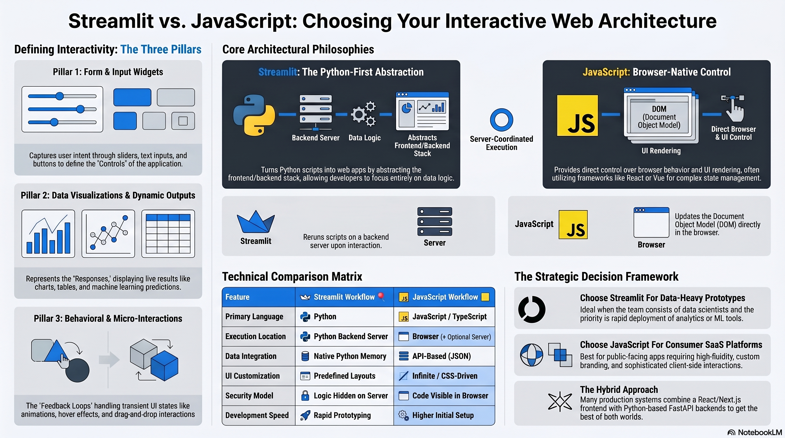

# Streamlit vs. JavaScript: A Beginner's Guide

## Table of Contents

1. [What is an "Interactive Web App"?](#1-what-is-an-interactive-web-app)
2. [How We Build Interactive Web Apps: The Two Philosophies](#2-how-we-build-interactive-web-apps-the-two-philosophies)
3. [Modern Frontend Framework Context](#3-modern-frontend-framework-context)
4. [Deep Dive Pillar 1: Form & Input Widgets (The Controls)](#4-deep-dive-pillar-1-form--input-widgets-the-controls)
5. [Deep Dive Pillar 2: Data Visualizations & Dynamic Outputs (The Responses)](#5-deep-dive-pillar-2-data-visualizations--dynamic-outputs-the-responses)
6. [Deep Dive Pillar 3: Behavioral & Micro-Interactions (The Feedback Loops)](#6-deep-dive-pillar-3-behavioral--micro-interactions-the-feedback-loops)
7. [Real-World Engineering Implications](#7-real-world-engineering-implications)
8. [The Core Comparison Matrix & TL;DR](#8-the-core-comparison-matrix--tldr)
9. [UI Elements Comparison: Streamlit vs JavaScript](#9-ui-elements-comparison-streamlit-vs-javascript)
10. [Streamlit Quickstart: Install, Code & Breakdown](#10-streamlit-quickstart-install-code--breakdown)
11. [JavaScript Quickstart: Setup, Code & Breakdown](#11-javascript-quickstart-setup-code--breakdown)
12. [The Strategic Decision Framework](#12-the-strategic-decision-framework)

---


# 1. What is an "Interactive Web App"?

Think about the last time you booked a flight or browsed a vacation rental platform online. You didn’t interact with a static webpage—you typed into search boxes, dragged sliders, filtered results, switched layouts, and watched maps update instantly without refreshing the page.

That experience is the hallmark of an **interactive web application**.

Unlike traditional static websites, interactive web apps behave more like software running directly inside your browser. They continuously respond to user actions and dynamically update the interface in real time.

Interactivity is generally built around three major pillars:

* **Pillar 1: Form & Input Widgets (The Controls):** Capture user intent through sliders, text inputs, dropdowns, buttons, and selectors.
* **Pillar 2: Data Visualizations & Dynamic Outputs (The Responses):** Display live results such as tables, charts, KPIs, analytics, or machine learning predictions.
* **Pillar 3: Behavioral & Micro-Interactions (The Feedback Loops):** Handle transient UI behaviors like animations, modals, hover states, drag-and-drop interactions, and responsive feedback.

[Back to Table of Contents](#table-of-contents)

---

# 2. How We Build Interactive Web Apps: The Two Philosophies

There are two fundamentally different philosophies for building interactive web applications.

## What is Streamlit?

Streamlit is an open-source Python framework designed to turn Python scripts into interactive web apps quickly. It abstracts away much of the traditional frontend and backend web stack, allowing developers to focus primarily on Python logic and data workflows.

You write Python code, and Streamlit automatically generates the interface and manages communication between the browser and the Python runtime.

## What is JavaScript?

JavaScript is the native programming language of the web browser. Combined with HTML and CSS, it powers modern interactive websites and frontend applications.

JavaScript gives developers direct control over browser behavior, interface rendering, animations, user events, and client-side application state.

Modern frontend ecosystems often build on top of JavaScript using frameworks such as:

* React
* Next.js
* Vue
* Svelte
* Solid

These frameworks provide higher-level abstractions for building complex applications while still running primarily within the browser environment.

[Back to Table of Contents](#table-of-contents)

---

# 3. Modern Frontend Framework Context

While this guide uses vanilla JavaScript examples for clarity, most modern production frontend systems are built using higher-level frameworks such as React, Next.js, Vue, Svelte, Solid, or Nuxt.

These frameworks introduce additional architectural layers including:

* Component-based rendering systems
* Virtual DOM reconciliation
* Server-side rendering (SSR)
* Static site generation (SSG)
* Incremental static regeneration (ISR)
* Edge rendering and streaming
* Client/server component separation

As a result, modern JavaScript applications are often hybrid systems where some logic executes on the server while other interactions execute directly in the browser.

The core comparison in this guide still holds conceptually:

* **Streamlit abstracts frontend engineering into a Python-first workflow**
* **JavaScript ecosystems expose deeper control over browser-native application architecture**

However, modern frontend frameworks reduce much of the manual DOM manipulation complexity traditionally associated with raw JavaScript development.

[Back to Table of Contents](#table-of-contents)

---

# 4. Deep Dive Pillar 1: Form & Input Widgets (The Controls)

This pillar is about how your app collects input from users — things like sliders, dropdowns, text boxes, and buttons — and how it arranges them on the page.

## How Much Control Do You Have Over the Layout?

* **Streamlit Layout Control:** Streamlit gives you ready-made building blocks. You call a Python function like `st.slider()` or `st.selectbox()` and the widget just appears — no need to write any HTML or CSS. You can also arrange things side by side using `st.columns`, group them into `st.tabs`, or wrap them in containers. This makes it very fast to put a working interface together. The trade-off is that the look and feel is largely determined by Streamlit. If you want something that looks very unique or has highly specific styling, you'll eventually need to write custom CSS or build a custom component.

* **JavaScript Layout Control:** With JavaScript (and HTML/CSS), you have full control over how everything looks and where it sits on the page. You can use layout techniques like Flexbox or CSS Grid to position elements exactly how you want, and frameworks like React, Vue, or Svelte make it easier to manage complex interfaces. This gives you a lot of creative freedom, but it also means more upfront work to get things looking polished.

## What Actually Happens When a User Clicks or Moves a Slider?

* **Streamlit's Script Execution:** Think of a Streamlit app as a Python script that reruns from top to bottom every time the user does something. When you move a slider, Streamlit sends that action to the Python server, reruns the whole script with the new value, and refreshes the page with the updated result. This is simple to reason about — you don't need to think about "what changed"; everything just recalculates. The downside is that if your script does something slow (like loading a large dataset), that rerun can feel sluggish unless you use caching to skip the expensive parts.

* **JavaScript's Event-Driven DOM:** JavaScript works differently. Instead of rerunning everything, it listens for specific user actions (called *events*) and only updates the exact part of the page that needs to change. For example, moving a slider might update just a number displayed next to it — nothing else on the page is touched. This is more efficient for fast, interactive feedback, but it also means you have to be more deliberate about telling the app *what* to update and *when*.

[Back to Table of Contents](#table-of-contents)

---

# 5. Deep Dive Pillar 2: Data Visualizations & Dynamic Outputs (The Responses)

This pillar is about how your app processes data and displays results — things like charts, tables, filtered lists, or machine learning predictions.

## How Does the App Connect to Your Data?

* **Streamlit Direct Python Integration:** Because Streamlit runs inside Python, it can use your data tools directly. Libraries like Pandas (for tables), NumPy (for numbers), Scikit-learn (for machine learning), and PyTorch (for deep learning) are all just Python imports — there's nothing extra to set up. Your data lives in Python memory the whole time, so passing it to a chart or table is as simple as handing it to another function.

* **JavaScript API Communication:** Browsers can't run Python, so JavaScript apps can't use those libraries directly. Instead, you need to build a separate Python *backend* (using something like FastAPI or Flask) that handles the data processing, and then have your JavaScript app send requests to it over the internet. The backend sends back results in a format called JSON, which JavaScript can read. This adds more moving parts, but it also means your Python backend can serve many different frontends — a website, a mobile app, etc.

## How Do Updates Get Shown on Screen?

* **Streamlit's Coordinated Rerun Model:** When something changes in a Streamlit app — say, a user applies a filter — the whole Python script reruns and the page re-renders with fresh results. This keeps things predictable: you always know that what you see reflects the latest state of the script. The key to keeping this fast is caching: by marking expensive steps (like loading a database) with `@st.cache_data`, Streamlit can skip re-running them unless the underlying data actually changes.

* **JavaScript's Client-Side State Updates:** JavaScript apps update only the specific parts of the page that need to change, directly inside the browser, without making a round-trip to a server for every interaction. Modern frameworks like React or Vue manage this through a concept called *component state* — each part of the UI tracks its own data, and when that data changes, only that component re-renders. This can make interfaces feel very snappy, especially for interactions that don't need fresh data from a server.

[Back to Table of Contents](#table-of-contents)

---

# 6. Deep Dive Pillar 3: Behavioral & Micro-Interactions (The Feedback Loops)

This pillar is about the small, responsive moments that make an app feel alive — things like a loading spinner, a pop-up confirmation box, a button that changes colour when you hover over it, or a file that downloads when you click a button.

## Does the Interface Feel Instant?

* **Streamlit Visual Feedback Model:** Every interaction in Streamlit — even a small one — involves a round-trip to the Python server. The browser sends the action, the server processes it and sends back the updated page, and then the browser displays the result. For most dashboards and internal tools, this happens fast enough that users barely notice. But if you're trying to build something with smooth animations, instant hover effects, or real-time drag-and-drop, this back-and-forth can introduce a noticeable lag. Streamlit does show a spinner during reruns to let users know something is happening.

* **JavaScript Client-Side Fluidity:** Because JavaScript runs directly in the browser, it can react to user actions immediately — no server trip needed. Hovering over a button, dragging a card, or animating a transition can all happen in milliseconds. This is why JavaScript is the go-to choice for interfaces where feel and responsiveness matter a lot, like consumer apps or anything with rich animations. That said, actions that need real data (like saving a record or fetching results) still involve a server call.

## Pop-Ups & Modals

* **Streamlit Dialogs:** Streamlit supports pop-up dialogs using `@st.dialog`. You define the dialog as a Python function, and Streamlit handles showing and hiding it as part of its normal rerun process. It's straightforward to use, though the dialog's behaviour is tied to the same rerun model as the rest of the app.

* **JavaScript Modals:** In JavaScript, modals are UI components that get added to or removed from the page on the fly, entirely inside the browser. Because there's no server involved, you can add polished open/close animations, custom transitions, and complex interaction patterns (like draggable or nested dialogs) with full control over the experience.

## Document & PDF Generation

* **Streamlit PDF Generation:** Streamlit apps generate PDFs on the server using Python libraries like FPDF2, ReportLab, or WeasyPrint. Once the file is ready, Streamlit offers it to the user as a download. This is great when your PDF needs to include processed data or charts generated by Python.

* **JavaScript PDF Generation:** JavaScript can create PDFs directly in the browser using libraries like `jsPDF` or `html2pdf.js` — no server required. This works well for simpler documents, like a summary of what's currently on screen. For more complex or heavily templated documents, PDF generation is often moved to a server to keep results consistent across different browsers.

[Back to Table of Contents](#table-of-contents)

---

# 7. Real-World Engineering Implications

## 1. Performance and Scale

### User Interface Responsiveness

* **Streamlit:** User interactions involve communication with a backend server, making performance dependent on network conditions and backend execution speed. Efficient caching and optimized computation pipelines are important for maintaining responsiveness.

* **JavaScript:** Many interface interactions can execute entirely within the browser, allowing highly responsive UI updates. However, extremely large datasets or expensive computations may still require backend processing or Web Workers.

### Heavy Computing

* **Streamlit:** Heavy computation runs on the server, making it suitable for analytics pipelines, machine learning workflows, and large-scale data processing.

* **JavaScript:** Modern browsers are highly capable, but computationally expensive workloads can still impact responsiveness if not carefully optimized.

---

## 2. Security and System Access

### Hardware & Operating System Access

* **Streamlit:** Because Streamlit executes within a Python environment, it can access local files, operating system resources, and backend infrastructure directly (subject to deployment permissions).

* **JavaScript:** Browser-based JavaScript operates inside a sandboxed environment with controlled access to system resources for security reasons.

### Code Visibility

* **Streamlit:** Backend logic typically remains on the server and is not directly exposed to users.

* **JavaScript:** Frontend application code is generally shipped to the browser and can be inspected through developer tools, though sensitive business logic is usually kept server-side.

---

## 3. Maintenance and Costs

### Developer Velocity

* **Streamlit:** Streamlit combines UI rendering and backend logic into a single Python workflow, allowing developers to build dashboards and internal tools rapidly with minimal frontend infrastructure.

* **JavaScript:** JavaScript applications often involve separate frontend and backend systems, increasing architectural flexibility but also introducing additional complexity around APIs, state management, routing, and deployment pipelines.

### Infrastructure & Rendering Costs

* **Streamlit:** Streamlit applications perform computation and rendering orchestration on the backend server, meaning infrastructure requirements scale with active users and workload complexity.

* **JavaScript:** JavaScript-based applications can shift a significant portion of interface rendering to the client browser, reducing some server-side rendering costs. However, modern frameworks such as Next.js, Remix, and Nuxt may also use server-side rendering (SSR), streaming, edge rendering, or hybrid execution strategies depending on application requirements.

[Back to Table of Contents](#table-of-contents)

---

# 8. The Core Comparison Matrix & TL;DR

| Feature                    | Streamlit Workflow 🎈                  | JavaScript Workflow 🟨                                  |
| -------------------------- | -------------------------------------- | ------------------------------------------------------- |
| **Primary Language**       | Python                                 | JavaScript / TypeScript                                 |
| **Execution Location**     | Python Backend Server                  | Browser + Optional Server Components                    |
| **Development Speed**      | Rapid Prototyping                      | More Architectural Setup                                |
| **Python Integration**     | Native / Direct                        | Usually via APIs                                        |
| **UI Customization**       | Component-Oriented Layouts             | Highly Customizable                                     |
| **Interactivity Depth**    | Strong Dashboard Interactions          | Fine-Grained Client Interactions                        |
| **UI Update Model**        | Server-Coordinated Reruns              | Client-Side State Updates                               |
| **Target Audience**        | Data apps, internal tools, prototypes  | Consumer apps, SaaS platforms, complex frontend systems |
| **Runtime Location**       | Python Backend Server                  | Browser + Optional Server Rendering                     |
| **UI Control Scope**       | Component-Oriented Layouts             | Extensive Layout Control                                |
| **Data Interaction**       | Direct Python Memory Access            | API-Based Communication                                 |
| **Rendering Strategy**     | Backend-Coordinated UI Rendering       | Browser Rendering + Optional SSR                        |
| **Security Model**         | Backend Logic Hidden Server-Side       | Frontend Code Visible in Browser                        |
| **Performance Focus**      | Backend Data Processing                | Responsive Client Interactions                          |
| **Infrastructure Model**   | Server-Centric                         | Hybrid Client/Server                                    |
| **Build Complexity**       | Lower Initial Complexity               | Higher Architectural Flexibility                        |
| **Typical Use Cases**      | Dashboards, analytics, internal tools  | SaaS apps, public platforms, advanced frontend systems  |
| **Scaling Strategy**       | Backend Scaling                        | Hybrid Scaling Models                                   |

## Quick Summary (TL;DR)

* **Execution Model:** In JavaScript applications, much of the interface logic executes directly inside the user's browser environment. In Streamlit, application logic executes primarily on a Python backend server, with user interactions triggering communication between the browser and the server runtime.

* **UI Flexibility:** JavaScript ecosystems provide extensive flexibility for building highly customized interfaces, animations, and frontend interaction systems. Streamlit prioritizes rapid application development and consistency through predefined components and layouts, which can simplify development but may limit advanced interface customization without additional frontend work.

* **Ecosystem Integration:** Streamlit integrates naturally with Python data tooling, machine learning libraries, and analytics workflows. JavaScript ecosystems integrate deeply with browser-native APIs, frontend frameworks, realtime communication systems, and modern web platform tooling. In production systems, hybrid architectures combining JavaScript frontends with Python APIs are also very common.

[Back to Table of Contents](#table-of-contents)

---

# 9. UI Elements Comparison: Streamlit vs JavaScript

The table below maps each Streamlit UI component to its closest JavaScript/HTML equivalent, along with notes on behavioural differences.

| Category | Streamlit Element | JavaScript / HTML Equivalent | Notes |
|---|---|---|---|
| **Text Display** | `st.title()` | `<h1>` | Streamlit auto-styles; JS requires CSS |
| **Text Display** | `st.header()` | `<h2>` | Same as above |
| **Text Display** | `st.subheader()` | `<h3>` | Same as above |
| **Text Display** | `st.text()` | `<p>` / `<pre>` | `st.text()` renders monospace by default |
| **Text Display** | `st.markdown()` | `innerHTML` / markdown parsers (e.g., `marked.js`) | Streamlit parses Markdown server-side; JS needs a client library |
| **Text Display** | `st.caption()` | `<small>` / `<figcaption>` | Used for helper text under widgets |
| **Text Display** | `st.code()` | `<code>` / `<pre>` + syntax highlighter (e.g., Prism.js, highlight.js) | Streamlit includes built-in syntax highlighting |
| **Text Display** | `st.latex()` | MathJax / KaTeX (`<script>` include) | Streamlit bundles LaTeX rendering; JS requires a library |
| **Metrics & KPIs** | `st.metric()` | Custom `<div>` with styled `<span>` elements | No native HTML equivalent; typically hand-crafted in JS/CSS |
| **Input — Text** | `st.text_input()` | `<input type="text">` | Streamlit reruns on submit; JS fires `input`/`change` events |
| **Input — Text** | `st.text_area()` | `<textarea>` | Same execution model difference as above |
| **Input — Text** | `st.number_input()` | `<input type="number">` | Both support min/max/step |
| **Input — Text** | `st.chat_input()` | `<input type="text">` + custom submit logic | No native chat-input HTML element |
| **Input — Selection** | `st.selectbox()` | `<select>` / `<option>` | Single-select dropdown |
| **Input — Selection** | `st.multiselect()` | `<select multiple>` or a custom tag-input component | `<select multiple>` is basic; rich multi-select needs JS libraries (e.g., Select2, Choices.js) |
| **Input — Selection** | `st.radio()` | `<input type="radio">` group | Functionally identical; styling differs |
| **Input — Selection** | `st.checkbox()` | `<input type="checkbox">` | Functionally identical |
| **Input — Selection** | `st.toggle()` | `<input type="checkbox">` styled as a toggle | No native HTML toggle; requires CSS or a UI library |
| **Input — Range** | `st.slider()` | `<input type="range">` | Both support min/max/step; Streamlit supports range (two-handle) sliders natively |
| **Input — Date/Time** | `st.date_input()` | `<input type="date">` | Browser date pickers vary across platforms |
| **Input — Date/Time** | `st.time_input()` | `<input type="time">` | Same cross-browser caveat |
| **Input — File** | `st.file_uploader()` | `<input type="file">` | Streamlit streams files to the Python backend; JS handles files client-side via the File API |
| **Input — Color** | `st.color_picker()` | `<input type="color">` | Both open a color picker; browser styling varies |
| **Buttons & Actions** | `st.button()` | `<button>` | Streamlit reruns the script on click; JS fires `click` event listeners |
| **Buttons & Actions** | `st.form_submit_button()` | `<button type="submit">` inside `<form>` | Streamlit batches widget values inside `st.form()`; JS uses `FormData` / `submit` event |
| **Buttons & Actions** | `st.download_button()` | `<a download href="...">` | Streamlit generates the file server-side; JS can generate files client-side (Blob URLs) |
| **Buttons & Actions** | `st.link_button()` | `<a href="..." target="_blank">` styled as a button | Functionally identical |
| **Layout** | `st.columns()` | CSS Flexbox / Grid (`display: flex` / `display: grid`) | Streamlit columns are Python context managers; JS/CSS requires explicit container markup |
| **Layout** | `st.tabs()` | Custom tab component or CSS tab pattern | No native HTML tab widget; typically built with JS + CSS or a UI library |
| **Layout** | `st.expander()` | `<details>` / `<summary>` | `<details>` is the native HTML equivalent; fully functional without JS |
| **Layout** | `st.container()` | `<div>` | Generic grouping element in both |
| **Layout** | `st.empty()` | A `<div>` updated via `element.innerHTML = ...` | `st.empty()` holds a placeholder that can be overwritten on reruns |
| **Layout** | `st.sidebar` | CSS-based sidebar (`position: fixed` panel) | No HTML semantic element; requires CSS/JS to implement |
| **Feedback & Status** | `st.spinner()` | CSS animation or `<progress>` / custom overlay | Streamlit shows a spinner during backend reruns |
| **Feedback & Status** | `st.progress()` | `<progress value="x" max="100">` | Functionally equivalent |
| **Feedback & Status** | `st.toast()` | CSS toast / notification libraries (e.g., Toastify, Notyf) | No native HTML toast element |
| **Feedback & Status** | `st.success()` / `st.info()` / `st.warning()` / `st.error()` | Custom `<div>` with CSS classes (e.g., Bootstrap alerts) | No native HTML alert-box element beyond `<dialog>` and `window.alert()` |
| **Feedback & Status** | `st.balloons()` / `st.snow()` | Canvas / CSS animation (custom) | Purely decorative; no HTML equivalent |
| **Dialogs & Overlays** | `@st.dialog` | `<dialog>` element or CSS modal overlay | HTML `<dialog>` is now broadly supported; JS needed to open/close it |
| **Data Display** | `st.dataframe()` | HTML `<table>` or a JS grid library (AG Grid, Tabulator, DataTables) | Streamlit provides sorting/filtering out of the box; vanilla `<table>` needs JS for interactivity |
| **Data Display** | `st.table()` | `<table>` (static) | Both render a static, non-interactive table |
| **Data Display** | `st.json()` | `<pre>` + JSON.stringify or a JSON-viewer library | Streamlit renders a collapsible JSON tree; `<pre>` is static |
| **Charts** | `st.line_chart()` / `st.bar_chart()` / `st.area_chart()` | Chart.js / D3.js / Recharts / Plotly.js | Streamlit wraps Altair/Vega internally; JS libraries offer more customisation |
| **Charts** | `st.pyplot()` | Canvas-based chart libraries (Chart.js, D3.js) | Matplotlib runs server-side and sends an image; JS charts render in the browser |
| **Charts** | `st.plotly_chart()` | Plotly.js (`<script src="plotly.min.js">`) | Both use Plotly; Streamlit passes the figure from Python, JS builds it client-side |
| **Charts** | `st.map()` | Leaflet.js / Mapbox GL JS / Google Maps API | Streamlit uses `pydeck`/Mapbox under the hood |
| **Media** | `st.image()` | `` | Functionally identical |
| **Media** | `st.audio()` | `<audio controls>` | Functionally identical |
| **Media** | `st.video()` | `<video controls>` | Functionally identical |
| **Navigation** | `st.page_link()` | `<a href="...">` | Streamlit handles multi-page routing internally |
| **Navigation** | `st.navigation()` / `st.Page()` | Client-side router (React Router, Vue Router) or `<a>` links | Streamlit multi-page apps map to Python files; JS apps use URL routing libraries |

[Back to Table of Contents](#table-of-contents)

---

# 10. Streamlit Quickstart: Install, Code & Breakdown

## Step 1: Set Up Your Environment

```bash
conda create --name data_env python=3.11 -y
conda activate data_env
pip install streamlit pandas
```

## Step 2: Create `app.py`

```python
import streamlit as st
import pandas as pd

st.set_page_config(page_title="Data Portal")

st.title("🎈 Metric Analytics Engine")

threshold = st.slider(
    "Minimum Score",
    min_value=0,
    max_value=100,
    value=40
)

data = pd.DataFrame({
    "Role": ["Data Engineer", "Data Scientist", "BI Analyst"],
    "Score": [88, 92, 35]
})

filtered = data[data["Score"] >= threshold]

st.metric("Matching Roles", len(filtered))
st.dataframe(filtered)
```

## Step 3: Run the App

```bash
streamlit run app.py
```

## Execution Breakdown

When the slider changes:

1. The browser sends the interaction event to the Streamlit backend.
2. Streamlit reruns the Python script.
3. Updated data is recomputed.
4. The interface refreshes with the new results.

This execution model prioritizes simplicity and rapid development over granular frontend rendering control.

[Back to Table of Contents](#table-of-contents)

---

# 11. JavaScript Quickstart: Setup, Code & Breakdown

## Step 1: Create `index.html`

```html
<!DOCTYPE html>
<html>
<head>
  <title>JS Dashboard</title>
</head>
<body>

<h1>🟨 Metric Dashboard</h1>

<input type="range" id="slider" min="0" max="100" value="40">
<p id="value"></p>

<script>
  const slider = document.getElementById("slider");
  const value = document.getElementById("value");

  slider.addEventListener("input", (e) => {
    value.textContent = e.target.value;
  });

  value.textContent = slider.value;
</script>

</body>
</html>
```

## Step 2: Run the File

Open `index.html` directly in your browser.

## Execution Breakdown

When the slider changes:

1. The browser captures the interaction locally.
2. JavaScript updates only the affected DOM node.
3. No full application rerun is required for this interaction.

Modern frameworks such as React or Vue add additional abstraction layers on top of this event-driven model, simplifying large-scale UI management.

[Back to Table of Contents](#table-of-contents)

---

# 12. The Strategic Decision Framework

## Choose Streamlit if:

1. You need a working prototype or dashboard quickly.
2. Your workflow depends heavily on Python libraries and data tooling.
3. Your application prioritizes analytics and functionality over highly customized frontend interactions.
4. Your team is primarily composed of data scientists, analysts, or backend engineers.

## Choose JavaScript if:

1. You need highly customized UI/UX behavior.
2. Your application requires sophisticated client-side interactions or realtime collaboration.
3. You are building a public-facing consumer application or SaaS platform.
4. You need deeper integration with browser-native APIs and frontend ecosystems.

## Choose a Hybrid Architecture if:

1. You want a modern frontend experience with Python backend services.
2. You need React/Next.js interfaces combined with machine learning or analytics APIs.
3. You require both advanced UI control and heavy backend computation.

A very common modern production stack is:

```text
React / Next.js Frontend
        ↓
FastAPI / Flask Backend
        ↓
Database / ML Systems
```

[Back to Table of Contents](#table-of-contents)
